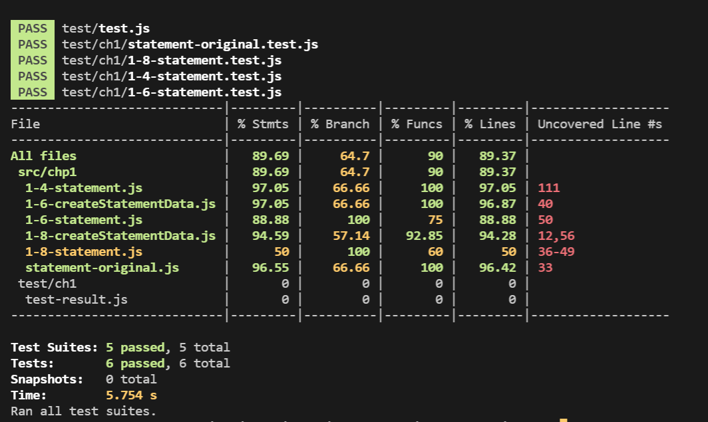

**프로그램이 새로운 기능을 추가하기 편한 구조라 아니라면,**

⇒ **기능을 추가하기 쉬운 현태로 리팩터링 하고 나서 원하는 기능을 추가한다.**

## 1.4 statement() 함수 쪼개기

---

> **함수 쪼개기 원칙**
>
> 1. 값이 변하지 않는 변수는 매개변수로 전달한다.
> 2. 함수 안에서 바뀌는 조심히 다뤄야 한다.
>    - 변수 초기화 고려
>    - 반환 값 사용여부에 대한 고려
>
> [별도 함수를 빼냈을 때 유효범위를 벗어나는 변수]
>
> → 새 함수에서는 사용할 수 없는 변수가 있는지 확인한다.
>
> ⇒ 새 함수에서도 필요하지만 값을 변경하지 않기 때문에 매개변수로 전달한다.
>
> ⇒ 함수 안에서 값이 바뀌는데 이런 변수는 조심해서 다뤄야한다.
>
> **함수 추출하기 (SIMPLE VERSION)**
>
> 1. 값이 변하지 않는 변수는 매개변수로 전달한다.
> 2. 함수내에 변수를 초기화하는 코드를 작성한다.

### _Insight_

1. **✨긴 함수를 리팩터링 할 떄는 전체 동작을 각각 부분으로 나눌 수 있는 지점을 찾는다.**

   (ex) _swtich_

2. **코드 조각을 별도 함수로 추출한다**
3. **별도 함수로 뺏을 때, 유효범위를 벗어나는 변수 유무를 확인한다.**
4. **✨리팩토링은 조금씩 변경하고 테스트하여, 피드백 주기를 짧게 가져감으로서 실수하더라도 버그를 쉽게 잡도록 한다.**
5. **추출 함수코드에서 명확하게 표현할 수 있는 방법을 찾는다.**

   (ex) 명확한 변수명

   (tip) 매개변수의 역할이 뚜렷하지 않을 떄는 부정관사(a/an)을 붙인다.

6. **계산 가능한 매개변수는 임시변수를 질의함수로 바꾸기를 통해 (7.4장) 리팩토링 할 수 있다.**
7. **지역 변수를 제거하여 얻는 큰 장점은 추출 작업이 쉬워진다는 것이다.**

   → 유효 범위를 신경 쓸 대상이 줄어든다.

8. **임시 변수에 유의할 것**

   →  자신이 속한 루틴에만 의미가 있어서 루틴이 길고 복잡해 질 수 있다.

9. **함수명 규칙을 세울 것**

   → 함수의 핵심에 맞춰서 이름을 붙인다. 함수 선언 바꾸기 참고

### _Refactoring point_

1.  장문 함수추출
2.  별도 함수를 추출 시, 유효범위를 벗어나는 유무 확인

    1. _값이 바뀌지 않는 변수_

       → _매개변수로 전달_

    2. _값이 바뀌는 변수_

       → _변수를 초기화하여 사용하고 반환_

3.  명학환 변수명
4.  computed하게 계산 가능한 불필요한 변수 제거
5.  변수 인라인 하기
6.  함수 선언 바꾸기
7.  임시 변수 제거

## 1.6 계산 단계와 포매팅 단계 분리

---

### _Insight_

1. **함수명은 함수의 핵심에 맞춰서 이름을 붙인다**.

   — 명확한 용도를 알 수 있게 한다. (함수 선언 바꾸기)

2. **전체 로직에서 구성하는 요소를 각각이 더 뚜렷이 부각하는 것이 좋다.**
3. **계산과 출력 형식의 분리**
4. **모듈화는 과정을 쉽게 파악 할 수 있게 한다.**
   -> 명시적인 코드의 중요성
5. **조건부 로직(10.4장)은 클래스를 통해서 조건부 로직으로 다형성 있게 바꿀 수 있다.**
6. **클래스 생성자를 팩터리 함수로 사용함으로서 서브클래스를 활용할 수 있다.**

---

### _Refactoring point_

1. 단위 쪼개기
2. statementData 중간 데이터 구조로 옮김으로서 매개변수 삭제
3. 중간데이터 구조에서 가져오면서 함수 옮기기(8.1장) 적용
4. 반복문을 파이프라인으로 바꾸기 (8.8장) 적용
   -> for문을 사용한 total값 reduce 적용
5. 중간데이터 생성 담당 function 생성

## 1.8 다형성을활용하여 재구현하기

조건부 로직을 명확한 구조로 보완하는 방법은 다양하지만, 객체 지향핵심인 다형성을 활용하면 좋다.

조건부 로직을 다형성 만들기

- 상속 계층부터 정의해야한다.
-

# TEST sanpshot

# 회고

### 컴파일→ 테스트 → 커밋

- 해당 단계를 반복하면서 짧은 커밋 주기를 가지고 버전 관리하는 것
  → 짧은 주기를 가지고 커밋하면, 회고와 디버깅에 이점을 줄 수 있을 것이라고 생각함.
  → 이 주기로 테스트 코드를 작성하면 코드 변화 검증시마다 적절한 테스트를 진행할 수 있을 것 같음.
  ⇒ Jest로 스냅샷(snapshot) 기능을 통해서 예상 결과를 미리 포착해두고 실제 결과에 비교하는 테스트 기법 등을 사용하면 좋을 것이라고 생각된다.

### 리팩토링 성능 문제

- '저자는 리팩터링 성능 문제에 관해서 특별한 경우가 아니라면 일단 무시하라'는 조언을 조언한다.
  — 리팩터링 목적은 성능 향상보다는 전체 흐름을 파악하기 쉽게 작성하는 것에 목적을 둔다.
  → 나를 포함하여 다른 사람들이 쉽게 파악하고, 수정할 수 있는 코드가 고이지 않는 코드를 만드는 주요한 핵심이다. 원활하고 커뮤니케이션이 협업하는 코드의 핵심이기 때문에 성능 문제보다는 파악하기 쉬운 코드가 우선순위로 갈 수 있다는 점이 인상 깊었다.

### 함수 분리, 변수명 원칙

**프로그램이 새로운 기능을 추가하기 편한 구조라 아니라면,**

⇒ **기능을 추가하기 쉬운 현태로 리팩터링 하고 나서 원하는 기능을 추가한다.**

## 1.4 statement() 함수 쪼개기

---

- 원본 함수를 중첩함수로 나누기

> **함수 쪼개기 원칙**
>
> 1. 값이 변하지 않는 변수는 매개변수로 전달한다.
> 2. 함수 안에서 바뀌는 조심히 다뤄야 한다.
>    - 변수 초기화 고려
>    - 반환 값 사용여부에 대한 고려
>
> [별도 함수를 빼냈을 때 유효범위를 벗어나는 변수]
>
> → 새 함수에서는 사용할 수 없는 변수가 있는지 확인한다.
>
> ⇒ 새 함수에서도 필요하지만 값을 변경하지 않기 때문에 매개변수로 전달한다.
>
> ⇒ 함수 안에서 값이 바뀌는데 이런 변수는 조심해서 다뤄야한다.
>
> **함수 추출하기 (SIMPLE VERSION)**
>
> 1. 값이 변하지 않는 변수는 매개변수로 전달한다.
> 2. 함수내에 변수를 초기화하는 코드를 작성한다.

### _Insight_

1. **✨긴 함수를 리팩터링 할 떄는 전체 동작을 각각 부분으로 나눌 수 있는 지점을 찾는다.**

   (ex) _swtich_

2. **코드 조각을 별도 함수로 추출한다**
3. **별도 함수로 뺏을 때, 유효범위를 벗어나는 변수 유무를 확인한다.**
4. **✨리팩토링은 조금씩 변경하고 테스트하여, 피드백 주기를 짧게 가져감으로서 실수하더라도 버그를 쉽게 잡도록 한다.**
5. **추출 함수코드에서 명확하게 표현할 수 있는 방법을 찾는다.**

   (ex) 명확한 변수명

   (tip) 매개변수의 역할이 뚜렷하지 않을 떄는 부정관사(a/an)을 붙인다.

6. **계산 가능한 매개변수는 임시변수를 질의함수로 바꾸기를 통해 (7.4장) 리팩토링 할 수 있다.**
7. **지역 변수를 제거하여 얻는 큰 장점은 추출 작업이 쉬워진다는 것이다.**

   → 유효 범위를 신경 쓸 대상이 줄어든다.

8. **임시 변수에 유의할 것**

   →  자신이 속한 루틴에만 의미가 있어서 루틴이 길고 복잡해 질 수 있다.

9. **함수명 규칙을 세울 것**

   → 함수의 핵심에 맞춰서 이름을 붙인다. 함수 선언 바꾸기 참고

### _Refactoring point_

1.  장문 함수추출
2.  별도 함수를 추출 시, 유효범위를 벗어나는 유무 확인

    1. _값이 바뀌지 않는 변수_

       → _매개변수로 전달_

    2. _값이 바뀌는 변수_

       → _변수를 초기화하여 사용하고 반환_

3.  명학환 변수명
4.  computed하게 계산 가능한 불필요한 변수 제거
5.  변수 인라인 하기
6.  함수 선언 바꾸기
7.  임시 변수 제거

## 1.6 계산 단계와 포매팅 단계 분리

---

### _Insight_

1. **함수명은 함수의 핵심에 맞춰서 이름을 붙인다**.

   — 명확한 용도를 알 수 있게 한다. (함수 선언 바꾸기)

2. **전체 로직에서 구성하는 요소를 각각이 더 뚜렷이 부각하는 것이 좋다.**
3. **계산과 출력 형식의 분리**
4. **모듈화는 과정을 쉽게 파악 할 수 있게 한다.**
   -> 명시적인 코드의 중요성
5. **조건부 로직(10.4장)은 클래스를 통해서 조건부 로직으로 다형성 있게 바꿀 수 있다.**
6. **클래스 생성자를 팩터리 함수로 사용함으로서 서브클래스를 활용할 수 있다.**

---

### _Refactoring point_

1. 단위 쪼개기
2. statementData 중간 데이터 구조로 옮김으로서 매개변수 삭제
3. 중간데이터 구조에서 가져오면서 함수 옮기기(8.1장) 적용
4. 반복문을 파이프라인으로 바꾸기 (8.8장) 적용
   -> for문을 사용한 total값 reduce 적용
5. 중간데이터 생성 담당 function 생성

## 1.8 다형성을활용하여 재구현하기

### _Insight_

1. 조건부 로직을 명확한 구조로 보완하는 방법은 다양하지만, 객체 지향핵심인 다형성을 활용하면 좋다.
2. 조건부 로직 다형성 만들때는 상속 계층부터 정의한다.
3. JS는 생성자가 서브클래스 인스턴스를 반환 할 수 없으므로, 생성자를 팩터리 함수로 바꿔서 사용한다.

조건부 로직을 다형성 만들기

- 상속 계층부터 정의해야한다.
-
# TEST sanpshot

# 회고

### 컴파일→ 테스트 → 커밋

- 해당 단계를 반복하면서 짧은 커밋 주기를 가지고 버전 관리하는 것
  → 짧은 주기를 가지고 커밋하면, 회고와 디버깅에 이점을 줄 수 있을 것이라고 생각함.
  → 이 주기로 테스트 코드를 작성하면 코드 변화 검증시마다 적절한 테스트를 진행할 수 있을 것 같음.
  ⇒ Jest로 스냅샷(snapshot) 기능을 통해서 예상 결과를 미리 포착해두고 실제 결과에 비교하는 테스트 기법 등을 사용하면 좋을 것이라고 생각된다.

### 리팩토링 성능 문제

- '저자는 리팩터링 성능 문제에 관해서 특별한 경우가 아니라면 일단 무시하라'는 조언을 조언한다.
  — 리팩터링 목적은 성능 향상보다는 전체 흐름을 파악하기 쉽게 작성하는 것에 목적을 둔다.
  → 나를 포함하여 다른 사람들이 쉽게 파악하고, 수정할 수 있는 코드가 고이지 않는 코드를 만드는 주요한 핵심이다. 원활하고 커뮤니케이션이 협업하는 코드의 핵심이기 때문에 성능 문제보다는 파악하기 쉬운 코드가 우선순위로 갈 수 있다는 점이 인상 깊었다.

### 리팩터링기법

- chapter1에서는 다양한 리팩터링 기법을 접할 수 있었다
  - 함수추출하기
  - 변수 인라인하기
  - 함수옮기기
  - 조건부 로직으로 다형성
- 이 기법들로 세 단계로 나누어서 진행되었으며 단계별로 코드가 수행하는 일을 명확히 확인 할 수 있었다.
- 리팩터링의 핵심은 코드가 하는 일을 파악하는데 있다. 코드가 명확해지고 이해하기 쉬워지면 개선 코드가 다시 보이고 선순환이 형성된다.
  → 리펙터링 기법들은 뒷 부분 챕터에 상세하게 기술되어 있다. 앞장에서는 다양한 기법들이 어떠한 방식으로 사용되는지 익히며, 필요성과 리팩터링의 흐름에 대해서 살펴 볼 수 있었다. 중간 과정에서는 기본 예제 함수가 더 깔끔하지 않는지에 대한 의문이 들었다. 하지만, 리팩토링하며 분리된 함수를 확인하니 각 수행 명확해 진 것을 확인 할 수 있었다. 이런 코드라면 디버깅 포인트를 명확히 할 수 있어 유지보수에 유리할 것이라는 생각이 들었다.
