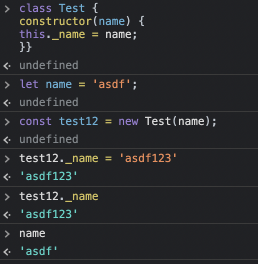
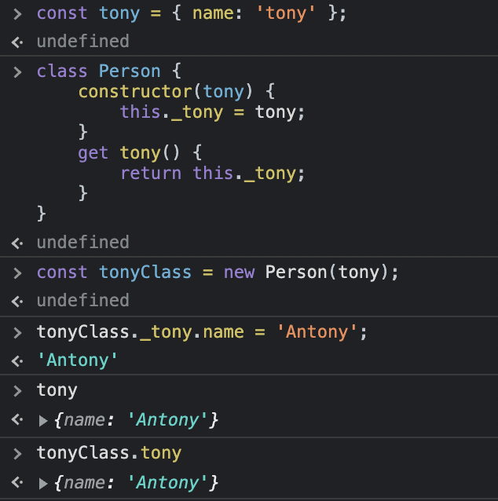

`cd 06_기본적인-리팩터링/06_기본적인-리팩터링_Tony`

#### note

- 절차의 상세 내용(->)은 나중에 다시 읽으면서 정리하자

# 06. 기본적인 리팩터링

- 카탈로그의 첫 머리(6장) : 가장 기본적이고 많이 사용해서 제일 먼저 배워야 하는 리팩터링들

- 함수 추출, 변수 추출
  - 함수 추출하기(6.1절), 변수 추출하기(6.3절)
  - 함수 인라인하기(6.2절), 변수 인라인하기(6.4절)
  - 함수 선언바꾸기(6.5절)
  - 변수 이름 바꾸기(6.7절), 변수 캡슐화하기(6.6절)
  - 매개변수 객체 만들기(6.8절)
- 고수준 모듈로 묶기
  - 여러 함수를 클래스로 묶기(6.9절)
- 단계 쪼개기(6.11절) : 묶은 모듈들의 작업 처리 과정을 명확한 단계(phase)로 구분

## 6.1 함수 추출하기

### 6.1.1 함수 추출하기 - 개요

```js
// 6.1 함수 추출하기
// 전
function printOwing(invoice) {
  printBanner();
  let outstanding = calculateOutstanding();

  // 세부 사항 출력 -> printDetails()로 추출
  console.log(`고객명 : ${invoice.customer}`);
  console.log(`채무액: ${outstanding}`);
}

// 후
function printOwing(invoice) {
  printBanner();
  let outstanding = calculateOutstanding();
  printDetails(outstanding);

  function printDetails(outstanding) {
    console.log(`고객명 : ${invoice.customer}`);
    console.log(`채무액: ${outstanding}`);
  }
}
```

### 6.1.2 함수 추출하기 - 배경

- 가장 많이 사용
- 함수라고 표현했지만 객체지향의 method에도 똑같이 적용
- 코드 조각을 찾아 무슨일을 하는지 파악 -> 독립된 함수로 추출 + 목적에 맞는 이름 붙이기

- 코드를 언제 독립된 함수로 묶어야 할까 - 의견은 수없이 많음

  - 길이 기준
    - e.g., 함수 하나가 한 화면을 넘어가면 안 된다
  - 재사용성 기준
    - 두 번 이상 사용될 코드는 함수로 만들고, 한 번만 쓰이는 코드는 인라인 상태로 놔두는 것
  - **목적과 구현을 분리** : 가장 합리적인 기준
    - 코드를 보고 무슨 일을 파악하는 데 한참이 걸린다면 -> 그 부분을 추출 + '무슨 일'에 걸맞는 이름 짓기
    - 함수를 아주 짧게, 대체로 단 몇 줄만 담도록 작성하는 습관이 생김

- 최적화를 할 때는 다음 두 규칙을 따른다

  - 1. 하지마라
  - 2. (전문가 한정) 아직 하지 마라

- 긴 함수에는 그 목적을 설명하는 주석이 달려있는 경우가 많은데 추출한 함수 이름을 지을 때 그 주석을 참고하면 도움이 된다

### 6.1.3 함수 추출하기 - 절차

#### 1) 함수를 새로 만들고 목적을 잘 드러내는 이름을 붙인다('어떻게'가 아닌 '무엇을' 하는지가 드러나야 한다).

- 추출 대상 코드가 매우 간단하더라도 함수로 추출해서 더 잘 드러나는 이름을 붙일 수 있다면 추출한다
  - 이런 이름이 떠오르지 않는다면 추출하면 안 된다는 신호
- 하지만 추출 과정에서 좋은 이름이 떠오를 수도 있다. 처음부터 최선의 이름부터 짓고 시작할 필요는 없다
- 일단 함수로 추출해서 사용해보고 효과가 크지 않으면 다시 원래 상태로 인라인해도 된다(그 과정에서 조금이라도 깨달은게 있다면 시간낭비가 아니다)
- 중첩함수를 지원하는 언어를 사용한다면 추출한 함수를 원래 함수안에 중첩시킨다
  - 유효범위를 줄일 수 있음
  - 원래 함수의 바깥으로 꺼내야 할 때가 오면 언제든 함수 옮기기를 적용(8.1절)

#### 2) 추출할 코드를 원본 함수에서 복사하여 새 함수에 붙여넣는다.

#### 3) 추출한 코드 중 원본 함수의 지역 변수를 참조하거나 추출한 함수의 유효범위를 벗어나는 변수는 없는지 검사한다. 있다면 매개변수로 전달한다.

#### 4) 변수를 다 처리했다면 컴파일한다

#### 5) 원본 함수에서 추출한 코드 부분을 새로 만든 함수를 호출하는 문장으로 바꾼다(즉, 추출한 함수로 일을 위임한다).

#### 6) 테스트한다

#### 7) 다른 코드에 방금 추출한 것과 똑같거나 비슷한 코드가 없는지 살핀다. 있다면 방금 추출한 새 함수를 호출하도록 바꿀지 검토한다(인라인 코드를 함수 호출로 바꾸기, 8.5절)

### 6.1.4 함수 추출하기 - 예시

#### 6.1.4.1 예시 : 유효범위를 벗어나는 변수가 없을 때

- 아주 간단한 코드에서는 함수 추출하기가 굉장히 쉽다

**추출 전**

```js
function printOwing(invoice) {
  let outstanding = 0;

  console.log("** 고객 채무 **");

  // 미해결 채무(outstanding)를 계산한다.
  for (const o of invoice.orders) {
    outstanding += o.amount;
  }

  // 마감일(dueDate)을 기록한다
  const today = Clock.today;
  invoice.dueDate = new Date(
    today.getFullYear(),
    today.getMonth(),
    today.getDate() + 30
  );

  // 세부 사항을 출력한다
  console.log(`고객명: ${invoice.customer}`);
  console.log(`채무액: ${outstanding}`);
  console.log(`마감일: ${invoice.dueDate.toLocaleDateString()}`);
}
```

<details>
<summary>Clock.today</summary>

- Clock.today : Clock Wrapper - 시스템 시계를 감싸는 객체
  - https://martinfowler.com/bliki/ClockWrapper.html
  - Date.now() 처럼 시스템 시간을 알려주는 함수를 직접 호출하지 않음
    - 직접 호출하면 테스트 할 때마다 결과가 달라져서 오류 상황을 재현하기가 어렵기 때문

</details>

**추출**

- 해당 코드를 잘라내서 새 함수에 붙이고, 원래 자리에 새 함수 호출문을 넣는다

```js
function printOwing(invoice) {
  let outstanding = 0;

  printBanner(); // 배너 출력 로직을 함수로 추출

  // 미해결 채무(outstanding)를 계산한다.
  for (const o of invoice.orders) {
    outstanding += o.amount;
  }

  // 마감일(dueDate)을 기록한다
  const today = Clock.today;
  invoice.dueDate = new Date(
    today.getFullYear(),
    today.getMonth(),
    today.getDate() + 30
  );

  printDetails(); // 세부 사항 출력 로직을 함수로 추출

  function printBanner() {
    // 배너 출력 - 내부 함수로 추출
    console.log("** 고객 채무 **");
  }

  function printDetail() {
    // 세부 사항 출력
    console.log(`고객명: ${invoice.customer}`);
    console.log(`채무액: ${outstanding}`);
    console.log(`마감일: ${invoice.dueDate.toLocaleDateString()}`);
  }
}
```

- printDetails()가 printOwing()에 중첩되도록 정의
  - printOwing()에 정의된 모든 변수에 접근 가능

#### 6.1.4.2 예시 : 지역 변수를 사용할 때

- (가장 간단한 경우) 지역변수를 사용하지만 다시 대입하지 않을 때 -> 지역변수들을 매개변수로 넘기면 됨

```js
function printOwing(invoice) {
  let outstanding = 0;

  printBanner();

  // 미해결 채무(outstanding)를 계산한다.
  for (const o of invoice.orders) {
    outstanding += o.amount;
  }

  recordDueDate(invoice); // 마감일 설정 로직을 함수로 추출(+매개변수 넘기기)

  printDetails(invoice, outstanding); // 앞의 예와 달리 지역 변수를 매개변수로 전달

  function printBanner() {
    console.log("** 고객 채무 **");
  }

  function printDetail(invoice, outstanding) {
    console.log(`고객명: ${invoice.customer}`);
    console.log(`채무액: ${outstanding}`);
    console.log(`마감일: ${invoice.dueDate.toLocaleDateString()}`);
  }

  function recordDueDate(invoice) {
    const today = Clock.today;
    invoice.dueDate = new Date(
      today.getFullYear(),
      today.getMonth(),
      today.getDate() + 30
    );
  }
}
```

- 지역 변수가 (배열, 레코드, 객체와 같은) 데이터 구조라면 똑같이 매개변수로 넘긴 후 필드값을 수정할 수 있다.

#### 6.1.4.3 예시 : 지역 변수의 값을 변경할 때

- 지역 변수에 값을 대입하게 되면 문제가 복잡해진다
  - 지금은 임시 변수만을 취급
  - 만약 매개변수에 값을 대입하는 코드를 발견하면 그 변수를 쪼개서 임시변수를 새로 하나 만들어 그 변수에 대입하게 한다
- 대입 대상이 되는 임시 변수 두 가지
  - 변수가 추출된 코드 안에서만 사용될 때
    - 추출된 변수 안에서만 존재
      - 만약 변수가 초기화 되는 지점과 실제로 사용되는 지점이 떨어져 있다면 문장 슬라이드하기(8.6절)를 활용하여 변수 조작을 모두 한곳에 처리하도록 모아두면 편하다
    - 변수가 추출한 함수 밖에서 사용될 때
      - 변수에 대입된 새 값을 반환해야 함

```js
function printOwing(invoice) {
  let outstanding = 0;

  printBanner();

  // 미해결 채무(outstanding)를 계산한다.
  for (const o of invoice.orders) {
    outstanding += o.amount;
  }

  recordDueDate(invoice);
  printDetails(invoice, outstanding);
}
```

- 단계를 나눠서 진행해보자

- 선언문을 변수가 사용되는 코드 근처로 슬라이드한다.

```js
function printOwing(invoice) {
  printBanner();

  // 미해결 채무(outstanding)를 계산한다.
  let outstanding = 0; // 맨 위에 있던 선언문을 이 위치로 이동
  for (const o of invoice.orders) {
    outstanding += o.amount;
  }

  recordDueDate(invoice);
  printDetails(invoice, outstanding);
}
```

2. [추출할 코드를 원본 함수에서 복사하여 새 함수에 붙여넣기]

- 그런 다음 추출할 부분을 새로운 함수로 복사한다.

```js
function printOwing(invoice) {
  printBanner();

  // 미해결 채무(outstanding)를 계산한다.
  let outstanding = 0; // 맨 위에 있던 선언문을 이 위치로 이동
  for (const o of invoice.orders) {
    outstanding += o.amount;
  }

  recordDueDate(invoice);
  printDetails(invoice, outstanding);
}

function calculateOutsatanding(invoice) {
  let outstanding = 0; // 추출할 코드 복사
  for (const o of invoice.orders) {
    outstanding += o.amount;
  }
  return outstanding; // 수정된 값 반환
}
```

3. [추출한 코드 중 원본 함수의 지역 변수를 참조하거나 추출한 함수의 유효범위를 벗어나는 변수는 없는지 검사한다. 있다면 매개변수로 전달한다.]

- `outstanding`의 선언문을 추출할 코드 앞으로 옮겼기 때문에 매개변수로 전달하지 않아도 된다.
- 추출할 코드에서 값이 변경된 변수는 outstanding뿐이다. 따라서 이 값을 반환한다.

4. [변수를 다 처리했다면 컴파일한다]

- Javascript 환경은 컴파일 해도 아무런 값을 출력하지 않는다
- 따라서 이 단계에서는 더 이상 할 일이 없다

5. [원본 함수에서 추출한 코드 부분을 새로 만든 함수를 호출하는 문장으로 바꾼다(즉, 추출한 함수로 일을 위임한다).]

- 다음으로 넘어가서 추출한 코드의 원래 자리를 새로 뽑아낸 함수를 호출하는 문장으로 교체한다.
- 추출한 함수에서 새 값을 반환하니, 이 값을 원래 변수에 저장한다.

```js
function printOwing(invoice) {
  printBanner();

  // 미해결 채무(outstanding)를 계산한다.
  const outstanding = calculateOutsatanding(invoice); // 함수 추출완료. 추출한 함수가 반환한 값을 원래 변수에 저장한다.

  recordDueDate(invoice);
  printDetails(invoice, outstanding);
}

function calculateOutsatanding(invoice) {
  let outstanding = 0; // 추출할 코드 복사
  for (const o of invoice.orders) {
    outstanding += o.amount;
  }
  return outstanding; // 수정된 값 반환
}
```

#### 값을 반환할 변수가 여러 개라면?

- 추출할 코드를 다르게 재구성하는 방향으로 처리

  - 각각을 반환하는 함수를 여러개 만들거나
  - 굳이 여러 값을 반환해야 한다면 값들을 레코드로 묶어서 반환해도 되지만, 임시 변수 추출 작업을 다른 방식으로 처리하는 것이 나을 때가 많다
    - 임시 변수를 질의 함수로 바꾸거나(7.4절)
    - 변수를 쪼개기(9.1절)로 처리하면 좋다

- 함수를 제대로 추출했는지 확인하려면 원본 함수와 같은 문맥으로 추출해보면 판별할 수 있다

## 6.2 함수 인라인하기

### 6.2.1 함수 인라인하기 - 개요

```js
// before
function getRating(driver) {
  return moreThanFiveLateDeliveries(driver) ? 2 : 1;
}

function moreThanFiveLateDeliveries(driver) {
  return driver.numberOfLateDeliveries > 5;
}

// after
function getRating(driver) {
  return driver.numberOfLateDeliveries > 5 ? 2 : 1;
}
```

## 6.3 변수 추출하기

## 6.4 변수 인라인하기

## 6.5 함수 선언 바꾸기

## 6.6 변수 캡슐화 하기

## 6.7 변수 이름 바꾸기

### 6.7.1 변수 이름 바꾸기 - 개요

```js
let a = height * width; // before
let area = height * width; // after
```

### 6.7.2 변수 이름 바꾸기 - 배경

- 명확한 프로그래밍의 핵심은 이름짓기다
- 이름의 중요성은 그 사용 범위에 영향을 많이 받는다
- 함수 호출 한번으로 끝나지 않고 값이 영속되는 필드라면 이름에 더 신경 써야 한다

### 6.7.3 변수 이름 바꾸기 - 절차

1. 폭넓게 쓰이는 변수라면 변수 캡슐화하기(6.6절)를 고려한다.
2. 이름을 바꿀 변수를 참조하는 곳을 모두 찾아서, 하나씩 변경한다
   - 다른 코드에서 참조하는 변수 -> 적용불가
     - 외부에 공개된 변수이므로
   - 변수 값이 변하지 않는다면 다른 이름으로 복제본을 만들어서 하나씩 점진적으로 변경한다.
     - 하나씩 바꿀 때마다 테스트한다
3. 테스트한다.

### 6.7.4 변수 이름 바꾸기 - 예시

#### 6.7.4.1 간단한 예시

- 가장 간단한 예 : 임시 변수나 인수 처럼 유효범위가 하나로 국한된 변수
- 조심해야될 변수 : 함수 밖에서도 참조할 수 있는 변수
  - 코드베이스 전체에서 두루 참조할 수도 있다.

```js
let tpHd = "untitled";

// 어떤 참조는 다음과 같이 변수를 읽기만 한다
result += `<h1>${tpHd}</h1>`;

// 값을 수정하는 곳도 있다고 해보자
tpHd = obj["articleTitle"];
```

1. [폭넓게 쓰이는 변수라면 변수 캡슐화하기(6.6절)를 고려한다.]

```js
result += `<h1>${title()}</h1>`;

setTitle(obj["articleTitle"]);

function title() {
  return tpHd;
} // tpHd 변수의 게터
function setTitle(arg) {
  tpHd = arg;
} // tpHd 변수의 세터
```

- 캡슐화 후에는 변수 이름을 바꿔도 된다

```js
let _title = "untitled";
function title() {
  return _title;
}
function setTitle(arg) {
  _title = arg;
}
```

2. [이름을 바꿀 변수를 참조하는 곳을 모두 찾아서, 하나씩 변경한다]

- 래핑 함수들을 인라인해서 모든 호출자가 변수에 직접 접근하게 하는 방법도 있지만, 별로 내키지 않는 방식이다
- 이름을 바꾸기 위해 캡슐화부터 해야 할 정도로 널리 사용되는 변수라면 나중을 위해서라도 함수 안에 캡슐화 된 채로 두는 편이 좋다

#### 6.7.4.2 변수 이름 바꾸기 - 예시 : 상수 이름 바꾸기

2. [이름을 바꿀 변수를 참조하는 곳을 모두 찾아서, 하나씩 변경한다]

- 상수(또는 클라이언트가 볼 때 상수처럼 작용하는 대상)의 이름은 캡슐화하지 않고도 복제방식으로 점진적으로 바꿀 수 있다

```js
// 복제 후 점진적으로 바꾸는 예시
const cpyNm = "애크미 구스베리";

// 원본의 이름을 바꾼 후, 원본의 원래 이름(기존 이름)과 같은 복제본을 만든다
const companyName = "애크미 구스베리";
const cpyNm = companyName;
```

- 기존 이름을 참조하는 코드들을 새 이름으로 점진적으로 바꾸고 다 바꿨다면 기존이름을 삭제한다.
  - 생각보다 좋은 방법일 것 같다 - 안전하게 바로 적용할 수 있을 것 같다

## 6.8 매개변수 객체 만들기

### 6.8.1 매개변수 객체 만들기 - 개요

```js
// before
function amountInvoiced(startDate, endDate) {...}
function amountReceived(startDate, endDate) {...}
function amountOverdue(startDate, endDate) {...}

// after
function amountInvoiced(aDateRange) {...}
function amountReceived(aDateRange) {...}
function amountOverdue(aDateRange) {...}
```

### 6.8.2 매개변수 객체 만들기 - 배경

- 데이터 항목 여러 개가 이 함수에서 저 함수로 함께 몰려다니는 경우를 자준 본다
- 이런 데이터 무리를 발견하면 데이터 구조 하나로 모아주곤 한다
- 데이터 뭉치를 데이터 구조로 묶으면 데이터 사이의 관계가 명확해짐
- 함수가 받는 매개변수 수도 줄어 듬
- 묶인 데이터를 사용하면 사용하는 이름도 같아져서 일관성도 높여줌
- 매개변수 객체만들기의 진정한 힘 : 코드를 더 근본적으로 바꿔줌
  - 데이터 구조를 활용하는 형태로 프로그램 동작을 재구성
  - 데이터 구조에 담길 데이터에 공통으로 적용되는 동작을 추출 -> 함수 -> 클래스

### 6.8.3 매개변수 객체 만들기 - 절차

1. 적당한 데이터 구조가 아직 마련되어 있지 않다면 새로 만든다.

   - 개인적으로 클래스로 만드는 걸 선호한다.
   - 나중에 동작까지 함께 묶기 좋기 때문이다.
   - 주로 데이터 구조를 값 객체([Value Object](https://martinfowler.com/bliki/ValueObject.html))로 만든다.

2. 테스트한다.
3. 함수 선언 바꾸기(6.5절)로 새 데이터 구조를 매개변수로 추가한다.
4. 테스트 한다.
5. 함수 호출 시 새로운 데이터 구조 인스턴스를 넘기도록 수정한다. 하나씩 수정할 때마다 테스트한다.
6. 기존 매개변수를 사용하던 코드를 새 데이터 구조의 원소를 사용하도록 바꾼다.
7. 다 바꿨다면 기존 매개변수를 제거하고 테스트한다.

### 6.8.4 매개변수 객체 만들기 - 예시

- 온도 측정 값 배열에서 정상 작동 범위를 벗어난 것이 있는지 검사하는 코드

```js
// 온도 측정값을 표현하는 데이터
const station = {
  name: "ZB1",
  readings: [
    { temp: 47, time: "2021-12-13 21:10" },
    { temp: 53, time: "2021-12-13 21:20" },
    { temp: 58, time: "2021-12-13 21:30" },
    { temp: 53, time: "2021-12-13 21:40" },
    { temp: 51, time: "2021-12-13 21:50" },
  ],
};

// 정상 범위를 벗어난 측정값을 찾는 함수
function readingsOutsideRange(station, min, max) {
  return station.readings.filter((r) => r.temp < min || r.temp > max);
}

// 호출문
alert = readingsOutsideRage(
  station,
  operatingPlan.temperatureFloor, // 최저 온도
  operatingPlan.temperatureCeiling
); // 최고 온도
```

- operatingPlan의 데이터 두 개를 쌍으로 가져와서 전달 하고 있음
- 함수의 arg이름(min, max)와 다르게 Floor, Ceiling으로 사용되고 있음

1. [적당한 데이터 구조가 아직 마련되어 있지 않다면 새로 만든다.]

- 먼저 묶은 데이터를 표현하는 클래스부터 선언하자

```js
class NumberRage {
  constructor(min, max) {
    this._data = { min: min, max: max };
  }
  get min() {
    return this._data.min;
  }
  get max() {
    return this._data.max;
  }
}
```

- 객체가 아닌 클래스를 사용한 이유

  - 매개변수 객체만들기 기법은 새로 생성한 객체로 동작까지 옮기는 더 큰 작업의 첫 단계로 수행될 때가 많기 때문

- 한편 값 객체(?)를 만들 가능성이 높기 때문에 setter는 만들지 않는다
  - 이 리팩터링을 할 때는 대부분 값 객체를 만들게 된다

3. [함수 선언 바꾸기(6.5절)로 새 데이터 구조를 매개변수로 추가한다.]

- 새로 만든 객체를 readingsOutsideRange()의 매개변수로 추가하도록 함수 선언을 바꾼다(6.5절)

```js
// 기존 함수에 매개변수 range만 더 추가 됨
function readingsOutsideRange(station, min, max, range) {
  return station.readings.filter((r) => r.temp < min || r.temp > max);
}
```

4. [테스트 한다.]

- 아직까지 동작은 하나도 바꾸지 않았으니 테스트는 문제없이 통과할 것이다.

5. [함수 호출 시 새로운 데이터 구조 인스턴스를 넘기도록 수정한다. 하나씩 수정할 때마다 테스트한다.]

- 이제 온도 범위를 개체 형태로 전달하도록 호출문을 하나씩 바꾼다.

```js
const range = new NumberRange(
  operatingPlan.temperatureFloor,
  operatingPlan.temperatureCeiling
); // 새로 만든 매개변수 객체

alerts = readingsOutsideRange(
  station,
  operatingPlan.temperatureFloor,
  operatingPlan.temperatureCeiling,
  range
); // 기존함수 그대로에 매개변수 객체만 추가로 전달
```

6. [기존 매개변수를 사용하던 코드를 새 데이터 구조의 원소를 사용하도록 바꾼다.]

- 매개변수를 사용하는 부분을 하나씩 변경 후 테스트한다.
- 다 바꿨으면 기존 매개변수를 제거한다.

```js
// max부터 적용
function readingsOutsideRange(station, min, range) {
  return station.readings.filter((r) => r.temp < min || r.temp > range.max);
}

// min에도 적용
function readingsOutsideRange(station, range) {
  return station.readings.filter(
    (r) => r.temp < range.min || r.temp > range.max
  );
}

// 호출문에 적용
const range = new NumberRange(
  operatingPlan.temperatureFloor,
  operatingPlan.temperatureCeiling
);

alerts = readingsOutsideRange(station, range);
```

- 매개변수 객체 만들기 끝

#### 진정한 값 객체로 거듭나기

- 매개변수 그룹을 객체로 교체하는 일은 진짜 값진 작업의 준비단계일 뿐이다.
- 클래스로 만들어두면 관련 동자가들을 이 클래스로 옮길 수 있다

```js
class NumberRage {
  constructor(min, max) {
    this._data = { min: min, max: max };
  }
  get min() {
    return this._data.min;
  }
  get max() {
    return this._data.max;
  }
  contains(arg) {
    // 온도가 허용 범위 안에 있는지 검사하는 메서드를 클래스에 추가 하기 위한 첫 단계
    return arg >= this.min && arg <= this.max;
  }
}

function readingsOutsideRange(station, range) {
  return station.readings.filter((r) => !range.contains(r.temp));
}
```

## 6.9 여러 함수를 클래스로 묶기

### 6.9.1 여러 함수를 클래스로 묶기 - 개요

```js
function base(aReading) {...}
function taxableCharge(aReading) {...}
function calculateBaseCharge(aReading) {...}

class Reading {
  base() {...}
  taxableCharge() {...}
  calculateBaseChare() {...}
}
```

### 6.9.2 여러 함수를 클래스로 묶기 - 배경

- 클래스
  - 빌딩 블록
  - 데이터와 함수를 하나의 공유 환경으로 묶은 후 -> 그 중 일부를 외부에 제공
  - 객체 지향 언어의 기본
- (함수 호출 시 인수로 전달되는) 공통 데이터를 중심으로 긴밀하게 엮여 작동하는 함수 무리
  - 클래스로 묶고 싶어짐
  - 클래스로 묶으면 이 함수들이 공유하는 공통 환경을 더 명확하게 표현할 수 있고,
  - 각 함수에 전달되는 인수를 줄여서 객체 안에서 함수 호출을 간결하게 만들 수 있다
  - 이런 객체를 시스템의 다른 부분에 전달하기 위한 참조를 제공할 수 있음
- `여러 함수를 클래스로 묶기`는 이미 만들어진 함수들을 재구성할 때는 물론

  - 새로 만든 클래스와 관련하여 놓친 연산을 찾아서 새 클래스의 메서드로 뽑아내는데도 좋다

- 함수를 한데 묶는 또 다른 방법 : 여러 함수를 변환 함수로 묶기(6.10절)

  - 어느 방식으로 진행할지는 프로그램 문맥을 넓게 살펴보고 정해야 함

- 클래스로 묶을 때의 장점

  - 클라이언트가 객체의 핵심 데이터를 변경할 수 있음
  - 파생 개게들을 일관되게 관리할 수 있음

- 중첩 함수보다 클래스를 선호
  - 중첩함수는 테스트하기가 까다로울 수 있기 때문
  - 또한 한 울타리로 묶을 함수들 중 외부에 공개할 함수가 여러 개일 때는 클래스를 사용할 수 밖에 없다

### 6.9.3 여러 함수를 클래스로 묶기 - 절차

1. 함수들이 공유하는 공통 데이터 레코드를 캡슐화(7.1절)한다.
   - 공통 데이터가 레코드 구조로 묶여 있지 않다면 먼저 매개변수 객체 만들기(6.8절)로 데이터를 하나로 묶는 레코드를 만든다
2. 공통 레코드를 사용하는 함수 각각을 새 클래스로 옮긴다(함수 옮기기8.1절)

   - 공통 레코드의 멤버는 함수 호출문의 인수 목록에서 제거한다

3. 데이터를 조작하는 로직들은 함수로 추출(6.1절)해서 새 클래스로 옮긴다

### 6.9.4 여러 함수를 클래스로 묶기 - 예시

- 정부에서 차(tea)를 수돗물 처럼 제공하는 예시
  - 사람들은 매달 tea 계량기를 읽어서 측정값(reading)을 다음과 같이 기록한다

```js
reading = { customer: "ivan", quantity: 10, month: 5, year: 2021 };
```

- 이 데이터로 비슷한 연산을 수행하는 부분이 많다고 가정

```js
// 클라이언트 1 - 기본 요금계산
const aReading = acquireReading();
const baseCharge = baseRate(aReading.month, aReading.year) * aReading.quantity;
```

```js
// 클라이언트 2 - 세금 부과계산(기본소비량만큼은 면세)
const aReading = acquireReading();
const base = baseRate(aReading.month, aReading.year) * aReading.quantity;
const taxableCharge = Math.max(0, base - taxThreshold(aReading.year));
// Threshold : 한계점
```

```js
// 클라이언트 3 - 함추 추출된 코드 발견
const aReading = acquireReading();
const basicChargeAmount = calculateBaseCharge(aReading);

// 기본 요금 계산 함수
function calculateBaseCharge(aReading) {
  return baseRate(aReading.month, aReading.year) * aReading.quantity;
}
```

- 이런 코드를 보면 본능적으로 앞의 두 클라이언트(클라이언트 1, 2)도 이 함수(클라이언트 3)를 사용하도록 고치려고 한다
- 하지만 이렇게 최상위 함수로 두면 못 보고 지나치기 쉽다는 문제가 있다
- 이런 함수를 데이터 처리 코드 가까이에 두는 것이 좋다 => **클래스**

1. [함수들이 공유하는 공통 데이터 레코드를 캡슐화(7.1절)한다.]

- 레코드를 클래스로 변환하기 위해 레코드를 캡슐화한다

```js
class Reading {
  constructor(data) {
    this._customer = data.customer;
    this._quantity = data.quantity;
    this._month = data.month;
    this._year = data.year;
  }
  get customer() {
    return this._customer;
  }
  get quantity() {
    return this._quantity;
  }
  get month() {
    return this._month;
  }
  get year() {
    return this._year;
  }
}
```

2. [공통 레코드를 사용하는 함수 각각을 새 클래스로 옮긴다(함수 옮기기8.1절)]

- 이미 만들어져 있는 calculateBaseCharge() 부터 옮기자
- 새 클래스를 사용하려면 데이터를 얻자마자 객체로 만들어야 한다

```js
// 클라이언트 3
const rawReading = acquireReading();
const aReading = new Reading(rawReading);
const basicChargeAmount = calculateBaseCharge(aReading);
```

- 그런 다음 calculateBaseCharge()를 새로 만든 클래스로 옮긴다(함수 옮기기8.1절).

```js
class Reading {
  constructor(data) {
    this._customer = data.customer;
    this._quantity = data.quantity;
    this._month = data.month;
    this._year = data.year;
  }
  get customer() {
    return this._customer;
  }
  get quantity() {
    return this._quantity;
  }
  get month() {
    return this._month;
  }
  get year() {
    return this._year;
  }
  get calculateBaseCharge() {
    // 메서드 이름을 원하는 대로 바꿀 수 있다 => get calculateBaseCharge()
    return baseRate(this.month, this.year) * this.quantity; // baseRate은 어디있지?
  }
}

// 클라이언트 3
const rawReading = acquireReading();
const aReading = new Reading(rawReading);
const basicChargeAmount = aReading.calculateBaseCharge; // 메서드 이름을 원하는 대로 바꿀 수 있다 => aReading.baseCharge;
```

- 메서드 이름을 원하는 대로 바꾼다

- 클라이언트 1, 2에 class를 사용한다

```js
// 클라이언트 1
const rawReading = acquireReading();
const aReading = new Reading(rawReading);
const baseCharge = aReading.baseCharge;
```

```js
// 클라이언트 2
const rawReading = acquireReading();
const aReading = new Reading(rawReading);
const taxableCharge = Math.max(
  0,
  aReading.baseCharge - taxThreshold(aReading.year)
);
```

3. [데이터를 조작하는 로직들은 함수로 추출(6.1절)해서 새 클래스로 옮긴다]

- 이어서 세금을 부과할 소비량을 계산하는 코드를 함수로 추출(6.1절)한다

```js
// 클라이언트 2
const rawReading = acquireReading();
const aReading = new Reading(rawReading);
const taxableCharge = taxableChargeFn(aReading);

function taxableChargeFn(aReading) {
  return Math.max(0, aReading.baseCharge - taxThreshold(aReading.year));
}
```

- 그리고 추출한 함수를 Reading 클래스로 옮긴다(함수 옮기기 8.1절)

```js
class Reading {
  constructor(data) {
    this._customer = data.customer;
    this._quantity = data.quantity;
    this._month = data.month;
    this._year = data.year;
  }
  get customer() {
    return this._customer;
  }
  get quantity() {
    return this._quantity;
  }
  get month() {
    return this._month;
  }
  get year() {
    return this._year;
  }
  get calculateBaseCharge() {
    // 메서드 이름을 원하는 대로 바꿀 수 있다 => get calculateBaseCharge()
    return baseRate(this.month, this.year) * this.quantity; // baseRate은 어디있지?
  }

  get taxableChargeFn() {
    return Math.max(0, this.baseCharge - taxThreshold(this.year));
  }
}

// 클라이언트 2 - 책에서 클라이언트 3으로 되어있는데 2가 맞음
const rawReading = acquireReading();
const aReading = new Reading(rawReading);
const taxableCharge = aReading.taxableCharge;
```

- 프로그램의 다른 부분에서 데이터를 갱신할 가능성이 꽤 있을 때는 클래스로 묶어두면 큰 도움이 된다

## 6.10 여러 함수를 변환 함수로 묶기

### 6.10.1 여러 함수를 변환 함수로 묶기 - 개요

```js
// before
function base(aReading) {...}
function taxableCharge(aReading) {...}

// after
function enrichReading(argReading) {
  const aReading = _.cloneDeep(argReading); // 새로운 레코드를 복사해서 생성
  aReading.baseCharge = base(aReading); // 레코드의 새필드로 기록
  aReading.taxableCharge = taxableCharge(aReading);
  return aReading; // 클라이언트가 레코드의 새 필드를 사용하도록 함
}
```

### 6.10.2 여러 함수를 변환 함수로 묶기 - 배경

- 정보가 사용되는 곳 마다 같은 도출 로직이 반복되기도 한다
- 이런 도출 작업들을 한데로 모아두면 검색과 갱신을 일관된 장소에서 처리할 수 있고 로직 중복도 막을 수 있다
- 변환 함수(transform) : 원본 데이터를 입력받아서 필요한 정보를 모두 도출한 뒤, 각각을 출력 데이터의 필드에 넣어 반환
  - 도출 과정을 검토할 일이 생겼을 때 변환함수만 살펴보면 된다
- 이 리팩터링(변환 함수로 묶기) 대신 클래스로 묶기(6.9절)로 처리해도 된다

  - 대체로 소프트웨어에 이미 반영된 프로그래밍 스타일을 따르는 편
  - 차이점 : 원본 데이터가 코드 안에서 갱신될 때는 클래스로 묶는 편이 훨씬 낫다
  - 변환 함수로 묶으면 가공한 데이터를 새로운 레코드에 저장하므로, 원본 데이터가 수정되면 일관성이 깨질 수 있기 때문

- 클래스로 묶기랑 거의 비슷한 것 같다 - 원본 데이터를 입력받은 것을 복사해서 사용하기 때문
  - 의문점 : 클래스의 생성자에서 this.레코드 = 원본레코드 는 깊은 복사인가?
    - primitive type은 맞지만 reference type은 아님
      
      

### 6.10.3 여러 함수를 변환 함수로 묶기 - 절차

1. 변환할 레코드를 입력받아서 값을 그대로 반환하는 변환 함수를 만든다

   - 이 작업은 대체로 깊은 복사로 처리해야 한다.
   - 변환함수가 원본 레코드를 바꾸지 않는지 검사하는 테스트를 마련해두면 도움될 때가 많다.

2. 묶을 함수 중 하나를 골라서 본문 코드를 변환 함수로 옮기고, 처리 결과를 레코드의 새 필드로 기록한다.

- 그런 다음 클라이언트가 이 필드를 사용하도록 수정한다.
  - 로직이 복잡하면 함수 추출하기(6.1절)부터 한다.

3. 테스트 한다.
4. 나머지 관련 함수도 위 과정에 따라 처리한다.

### 6.10.4 여러 함수를 변환 함수로 묶기 - 예제

- 6.9와 같이 차(tea)를 사용한 측정량에 대한 요금 계산하는 예시

```js
reading = { customer: "ivan", quantity: 10, month: 5, year: 2021 };

// 클라이언트 1 - 기본 요금계산
const aReading = acquireReading();
const baseCharge = baseRate(aReading.month, aReading.year) * aReading.quantity;

// 클라이언트 2 - 세금 부과계산(기본소비량만큼은 면세)
const aReading = acquireReading();
const base = baseRate(aReading.month, aReading.year) * aReading.quantity;
const taxableCharge = Math.max(0, base - taxThreshold(aReading.year));

// 클라이언트 3 - 함추 추출된 코드 발견
const aReading = acquireReading();
const basicChargeAmount = calculateBaseCharge(aReading);

// 기본 요금 계산 함수 - 클라이언트 3 에서 만들어 둔 것
function calculateBaseCharge(aReading) {
  return baseRate(aReading.month, aReading.year) * aReading.quantity;
}
```

1. [변환할 레코드를 입력받아서 값을 그대로 반환하는 변환 함수를 만든다]

- 입력 객체를 그대로 복사해 반환하는 변환함수를 만든다.

```js
function enrichReading(original) {
  const result = _.cloneDeep(original);
  return result;
}
```

- 깊은 복사는 lodash 라이브러리가 제공하는 cloneDeep()으로 처리
- `enrich` vs `transform`
  - enrich : 본질은 같고 부가 정보만 덧붙이는 함수
  - transform : 형태가 변할 때

2. [묶을 함수 중 하나를 골라서 본문 코드를 변환 함수로 옮기고, 처리 결과를 레코드의 새 필드로 기록한다.]

- 변경하려는 계산 로직 중 하나를 고른다.
- 이 계산 로직에 측정값을 전달하기 전에 부가 정보를 덧 붙이도록 수정한다.

```js
function enrichReading(original) {
  const result = _.cloneDeep(original);
  result.baseCharge = calculateBaseCharge(result); // 미가공 측정값에 기본 소비량을 부가 정보로 덧 붙임
  return result;
}

// 변환함수를 적용한 클라이언트 3
const rawReading = acquireReading();
const aReading = enrichReading(rawReading);
const basicChargeAmount = aReading.baseCharge;
```

- 주의 : 원본 측정값을 변경하면 안된다(lodash의 cloneDeep 메서드 사용 필요)
  - 이를 확인하는 테스트를 작성해주는 것이 좋다

```js
// 원본 값이 변하지 않았는지 테스트하는 코드
it("check reading unchanged", function () {
  const baseReading = { customer: "ivan", quantity: 15, month: 5, year: 2017 };
  const oracle = _.cloneDeep(baseReading);
  enrichReading(baseReading);
  // assert.deepEqual(baseReading, oracle);
  expect(baseReading).toEqual(oracle);
});
```

```js
// jest : toBe vs toEqual
function addScore(player,scoreToAdd){
    player.score += scoreToAdd;
}

# 1st way
addScore(player1,20);
expect(player1).toBe({name:"Amit", score:40});  // Fails

# 2nd way
addScore(player1,20);
expect(player1).toEqual({name:"Amit", score:40});  // Passes

// toEqual is better than toBe for test
```

4. [나머지 관련 함수도 위 과정에 따라 처리한다.]

- 세금을 부과할 소비량 계산도 `여러 함수를 변환함수로 묶기`를 적용하자

```js
function enrichReading(original) {
  const result = _.cloneDeep(original);
  result.baseCharge = calculateBaseCharge(result);
  result.taxableCharge = Math.max(
    0,
    result.baseCharge - taxThreshold(result.year)
  );
  return result;
}

const rawReading = acquireReading();
const aReading = enrichReading(rawReading);
const taxableCharge = aReading.taxableCharge;
```

#### 여러함수를 변환함수로 묶기할 때 주의 점

- 클라이언트가 데이터를 변경하면 심각한 문제가 생길 수 있는데
- 이런 문제를 방지하기 가장 좋은 방법은 여러 함수를 클래스로 묶기(6.9절)이다.
- 불변성을 제공하지 않는 언어(javascript)라도 웹 페이지에 출력할 부가 데이터를 도출할 때 처럼 데이터가 읽기 전용 문맥에서 사용될 때는 여러 함수를 변환함수로 묶기를 사용할 수 있다.
  - [javascript 불변성을 제공하지 않음](https://github.com/Functional-JavaScript/FunctionalES/blob/master/articles/ES6%2C%20%ED%95%A8%EC%88%98%ED%98%95%20%ED%94%84%EB%A1%9C%EA%B7%B8%EB%9E%98%EB%B0%8D%2C%20%EB%B9%84%EB%8F%99%EA%B8%B0%2C%20%EB%8F%99%EC%8B%9C%EC%84%B1%20%ED%94%84%EB%A1%9C%EA%B7%B8%EB%9E%98%EB%B0%8D/2.%20%ED%95%A8%EC%88%98%ED%98%95%20%ED%94%84%EB%A1%9C%EA%B7%B8%EB%9E%98%EB%B0%8D%20%EA%B4%80%EC%A0%90%EC%97%90%EC%84%9C%20%EB%B0%94%EB%9D%BC%EB%B3%B8%20%EC%9E%90%EB%B0%94%EC%8A%A4%ED%81%AC%EB%A6%BD%ED%8A%B8%EC%9D%98%20%EA%B0%92.md#%EB%B6%88%EB%B3%80%EC%84%B1)

#### 내 생각

- javascript로 class를 사용하더라도 불변성이 완전히 보장되진 않는다
- javascript 함수형 프로그래밍에 대해 공부해야겠다

## 6.11 단계 쪼개기(Split Phase)

### 6.11.1 단계 쪼개기 - 개요

```js
// before
const orderData = orderString.split(/\s+/); // 공백을 기준으로 문자열을 나눠서 배열로 return
const productPrice = priceList[orderData[0].split("-")[1]]; // 서로 다른 대상을 한꺼번에 다루는 코드 : priceList, orderData
const orderPrice = parseInt(orderData[1]) * productPrice;

// after
const orderRecord = parseOrder(order);
const orderPrice = price(orderRecord, priceList);
function parseOrder(aString) {
  const values = aString.split(/\s+/);
  return {
    productID: values[0].split("-")[1],
    quantity: parseInt(values[1]),
  };
}
function price(order, priceList) {
  return order.quantity * priceList[order.productID];
}
```

- 인라인하기랑 반대같은 느낌이네(인라인하기 공부하고 다시 비교해보자)

### 6.11.2 단계 쪼개기 - 배경

- 서로 다른 두 대상을 한꺼번에 다루는 코드 -> 각각 별개 모듈로 나눔
- 코드를 수정해야할 때 두 대상을 동시에 생각할 필요 없이 하나에만 집중하기 위함
- e.g. 입력이 처리 로직에 접합하지 않은 형태로 들어오는 경우
  - 본 작업에 들어가기 전에 입력값을 다루기 편한 형태로 가공한다
  - 아니면 로직을 순차적인 단계들로 분리해도 된다
  - 이때 각 단계는 서로 확연히 다른 일을 수행해야 한다
- 가장 대표적인 예 : 컴파일러
  - 컴파일러 - 실행 가능한 형태로 변환
- 다른 단계로 볼 수 있는 코드 영역들이 서로 다른 데이터와 함수를 사용 => 단계 쪼개기
  - 이 코드 영역들을 별도 모듈로 분리하면 그 차이를 코드에서 훨씬 분명하게 드러낼 수 있다

### 6.11.3 단계 쪼개기 - 절차

1. 두 번째 단계에 해당하는 코드를 독립 함수로 추출한다.
2. 테스트 한다.
3. `중간 데이터 구조`를 만들어서 앞에서 `추출한 함수의 인수로 추가`한다.
4. 테스트 한다.
5. 추출한 두 번째 단계 함수의 매개변수를 하나씩 검토한다.

- 그중 첫 번째 단계에서 사용되는 것은 중간 데이터 구조로 옮긴다.
- 하나씩 옮길 때 마다 테스트한다.
  - 간혹 두 번째 단계에서 사용하면 안되는 매개변수가 있다
    - 이럴 때는 각 매개변수를 사용한 결과를 -> 중간 데이터 구조의 필드로 추출
    - 이 추출한 필드의 값을 설정하는 문장을 호출한 곳으로 옮긴다(-> 아직 이해 안됨)

6. 첫 번째 단계 코드를 함수로 추출(6.1절)하면서 중간 데이터 구조를 반환하도록 만든다.
   - 이때 첫 번째 단계를 변환기(transformer <-> enrich)객체로 추출해도 좋다

### 6.11.4 단계 쪼개기 - 예시

#### 6.11.4.1 상품의 결재 금액을 계산하는 코드를 단계 쪼개기

```js
function priceOrder(product, quantity, shippingMethod) {
  const basePrice = product.basePrice * quantity;
  const discount =
    Math.max(quantity - product.discountThreshold, 0) *
    product.basePrice *
    product.discountRate;
  const shippingPerCase =
    basePrice > shippingMethod.discountThreshold
      ? shippingMethod.discountedFee
      : shippingMethod.feePerCase;
  const shippingCost = quantity * shippingPerCase;
  const price = basePrice - discount + shippingCost;
  return price;
}
```

- 계산이 두 단계로 이루어짐
  - 앞 부분 : 상품 정보를 이용 -> 결제 금액 중 상품 가격을 계산
  - 뒷 부분 : 배송 정보를 이용 -> 결제 금액 중 배송비를 계산
- 나중에 상품 가격과 배송비 계산을 더 복잡하게 만드는 변경이 생긴다면?
  - 이 코드는 두 단계로 나누는 것이 좋다

1. [두 번째 단계에 해당하는 코드를 독립 함수로 추출한다.]

- 먼저 배송비 계산 부분을 함수로 추출(6.1절)한다.

```js
function priceOrder(product, quantity, shippingMethod) {
  const basePrice = product.basePrice * quantity;
  const discount =
    Math.max(quantity - product.discountThreshold, 0) *
    product.basePrice *
    product.discountRate;
  const price = applyShipping(basePrice, shippingMethod, quantity, discount); // 함수 추출하기 적용
  return price;
}

function applyShipping(basePrice, shippingMethod, quantity, discount) {
  const shippingPerCase =
    basePrice > shippingMethod.discountThreshold
      ? shippingMethod.discountedFee
      : shippingMethod.feePerCase;
  const shippingCost = quantity * shippingPerCase;
  const price = basePrice - discount + shippingCost;
  return price;
}
```

- 두 번째 단계(배송 정보를 이용 -> 결제 금액 중 배송비를 계산)에 필요한 데이터를 모두 개별 매개변수로 전달
- 실전에선 매개변수가 상당히 많을 수 있는데, 어차피 나중에 걸러짐(-> 절차 5. 에서)

3. [`중간 데이터 구조`를 만들어서 앞에서 `추출한 함수의 인수로 추가`한다.]

- 첫 번째 단계와 두 번째 단계가 주고받을 중간 데이터 구조를 만든다

```js
function priceOrder(product, quantity, shippingMethod) {
  const basePrice = product.basePrice * quantity;
  const discount =
    Math.max(quantity - product.discountThreshold, 0) *
    product.basePrice *
    product.discountRate;
  const priceData = {}; // 중간 데이터 구조
  const price = applyShipping(
    priceData, // 중간 데이터 구조를 전달
    basePrice,
    shippingMethod,
    quantity,
    discount
  );
  return price;
}

function applyShipping(
  priceData, // 전달한 중간 데이터 구조를 받음
  basePrice,
  shippingMethod,
  quantity,
  discount
) {
  const shippingPerCase =
    basePrice > shippingMethod.discountThreshold
      ? shippingMethod.discountedFee
      : shippingMethod.feePerCase;
  const shippingCost = quantity * shippingPerCase;
  const price = basePrice - discount + shippingCost;
  return price;
}
```

5. [추출한 두 번째 단계 함수의 매개변수를 하나씩 검토한다.]
   > - 그중 첫 번째 단계에서 사용되는 것은 중간 데이터 구조로 옮긴다.
   > - 하나씩 옮길 때 마다 테스트한다.
   > - 간혹 두 번째 단계에서 사용하면 안되는 매개변수가 있다
   > - 이럴 때는 각 매개변수를 사용한 결과를 -> 중간 데이터 구조의 필드로 추출
   > - 이 추출한 필드의 값을 설정하는 문장을 호출한 곳으로 옮긴다(-> 아직 이해 안됨)

#### 이제 applyShipping()에 전달되는 다양한 매개변수를 살펴보자

##### 5.1 basePrice

- 이중 basePrice는 첫 번째 단계를 수행하는 코드에서 생성됨
  - 따라서 중간 데이터 구조로 옮기고 매개변수 목록에서 제거

```js
function priceOrder(product, quantity, shippingMethod) {
  const basePrice = product.basePrice * quantity;
  const discount =
    Math.max(quantity - product.discountThreshold, 0) *
    product.basePrice *
    product.discountRate;
  const priceData = {
    basePrice: basePrice,
  };
  const price = applyShipping(
    priceData,
    // basePrice, // 중간 데이터로 옮겨짐
    shippingMethod,
    quantity,
    discount
  );
  return price;
}

function applyShipping(
  priceData,
  // basePrice,
  shippingMethod,
  quantity,
  discount
) {
  const shippingPerCase =
    priceData.basePrice > shippingMethod.discountThreshold
      ? shippingMethod.discountedFee
      : shippingMethod.feePerCase;
  const shippingCost = quantity * shippingPerCase;
  const price = priceData.basePrice - discount + shippingCost;
  return price;
}
```

##### 5.2 다음으로 shippingMethod를 보자.

- shippingMethod는 첫 번째 단계(priceOrder함수)에서 사용하지 않고 전달만 하므로 그대로 둔다

##### 5.3 quantity

- 첫 번째 단계에서 사용하지만 거기서 생성된 것은 아니다
- 그래서 그냥 매개변수로 놔둬도 된다
- 하지만 중간 구조에 담는걸 선호하기에 이것도 중간 데이터 구조로 옮긴다

```js
function priceOrder(product, quantity, shippingMethod) {
  const basePrice = product.basePrice * quantity;
  const discount =
    Math.max(quantity - product.discountThreshold, 0) *
    product.basePrice *
    product.discountRate;
  const priceData = {
    basePrice: basePrice,
    quantity: quantity,
  };
  const price = applyShipping(
    priceData,
    shippingMethod,
    // quantity,
    discount
  );
  return price;
}

function applyShipping(
  priceData,
  shippingMethod,
  // quantity,
  discount
) {
  const shippingPerCase =
    priceData.basePrice > shippingMethod.discountThreshold
      ? shippingMethod.discountedFee
      : shippingMethod.feePerCase;
  const shippingCost = priceData.quantity * shippingPerCase;
  const price = priceData.basePrice - discount + shippingCost;
  return price;
}
```

##### discount

- basePrice 과 같이 첫 번째 단계를 수행하는 코드에서 생성됨
- 따라서 중간 데이터 구조로 옮기고 매개변수 목록에서 제거

```js
function priceOrder(product, quantity, shippingMethod) {
  const basePrice = product.basePrice * quantity;
  const discount =
    Math.max(quantity - product.discountThreshold, 0) *
    product.basePrice *
    product.discountRate;
  const priceData = {
    basePrice: basePrice,
    quantity: quantity,
    discount: discount,
  };
  const price = applyShipping(
    priceData,
    shippingMethod
    // discount
  );
  return price;
}

function applyShipping(
  priceData,
  shippingMethod
  // discount
) {
  const shippingPerCase =
    priceData.basePrice > shippingMethod.discountThreshold
      ? shippingMethod.discountedFee
      : shippingMethod.feePerCase;
  const shippingCost = priceData.quantity * shippingPerCase;
  const price = priceData.basePrice - priceData.discount + shippingCost;
  return price;
}
```

- 중간 데이터 구조 완성 됨

6. [첫 번째 단계 코드를 함수로 추출(6.1절)하면서 중간 데이터 구조를 반환하도록 만든다.]
   > - 이때 첫 번째 단계를 변환기(transformer <-> enrich)객체로 추출해도 좋다

- 이제 첫 번째 단계 코드를 함수로 추출하고 이 데이터 구조를 반환하게 한다

```js
function priceOrder(product, quantity, shippingMethod) {
  const priceData = calculatePricingData(product, quantity);
  return (price = applyShipping(priceData, shippingMethod)); // 최종 결과를 담은 상수들(price)도 깔끔하게 정리
}

// 첫 번째 단계를 처리하는 함수
function calculatePricingData(product, quantity) {
  const basePrice = product.basePrice * quantity;
  const discount =
    Math.max(quantity - product.discountThreshold, 0) *
    product.basePrice *
    product.discountRate;
  return {
    basePrice,
    quantity,
    discount,
  };
}

// 두 번째 단계를 처리하는 함수
function applyShipping(priceData, shippingMethod) {
  const shippingPerCase =
    priceData.basePrice > shippingMethod.discountThreshold
      ? shippingMethod.discountedFee
      : shippingMethod.feePerCase;
  const shippingCost = priceData.quantity * shippingPerCase;
  return (price = priceData.basePrice - priceData.discount + shippingCost); // 최종 결과를 담은 상수들(price)도 깔끔하게 정리
}
```

- 자바 예시는 미래의 나에게 맡긴다
