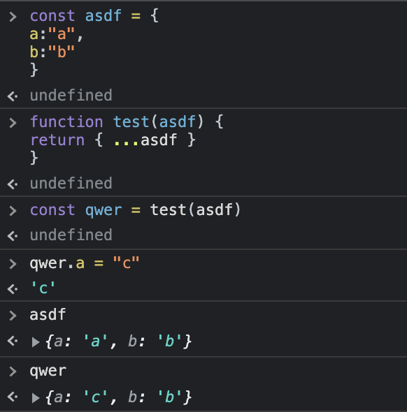
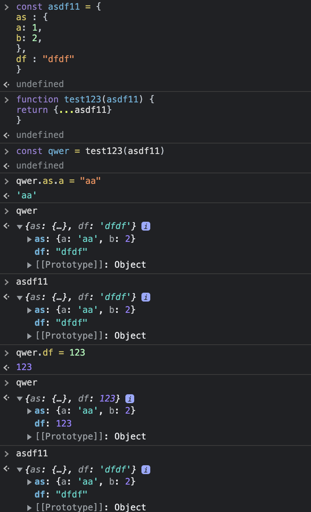

# 07. 캡슐화

- 모듈 분리의 가장 중요한 기준 -> 캡슐화 : 자신을 제외한 다른 부분을 숨김

## 7.1 레코드 캡슐화 하기

- 레코드를 데이터 클래스로 전환

### 7.1.1 레코드 캡슐화 하기 - 개요

```js
// before - 레코드 형태
organization = {
  name: "애크미 구스베리",
  country: "GB"
}

// after - 클래스 형태
class Organization {
  constructor(data) {
    this._name = data.name;
    this._country = data.country;
  }
  get name() {return this._name;}
  set name(arg) {this._name = arg;}
  get country() {return this._country;}
  set country(arg) {return._country = arg;}
}
```

### 7.1.2 레코드 캡슐화 하기 - 배경

#### 레코드의 단점

- `계산해서 얻을 수 있는 값`과 `그렇지 않은 값`을 `명확히 구분해 저장해야` 하는 점이 번거로움
  - `가변 데이터를 저장`하는 용도로는 레코드 보다 `객체(클래스)를 선호`

#### 캡슐화 장점

- 객체 사용 -> 어떻게 저장했는지 숨긴 채 각각의 메서드로 제공할 수 있음
- 사용자는 무엇이 저장된 값이고 무엇이 계산된 값인지 알 필요가 없음
- 이름 바꿀 때도 좋음
  - 필드 이름을 바꿔도 기존 이름과 새 이름 모두를 각각의 메서드로 제공할 수 있음
  - 사용자 모두가 새로운 메서드로 옮겨갈 때 까지 점진적으로 수정할 수 있음

#### 레코드 사용 예

- 가변 데이터가 아닌 불변이면 레코드에 저장해도 됨
  - 이름 바꿀 때 복사 후 점진적으로 바꾼다면 객체의 이름 바꾸기 장점을 비슷하게 수행 가능

#### 레코드 구조 두가지

- 1. 필드 이름을 노출하는 형태
- 2. (필드를 외부로 숨겨서)내가 원하는 이름을 쓸 수 있는 형태
  - 라이브러리에서 hash, map, hashmap, dictionary, associative array(연관 배열) 등의 이름으로 제공
    - 해시맵을 사용하는 곳이 많을 수록 불분명함으로 인해 발생하는 문제가 커짐
    - 이러한 불투명한 레코드를 명시적인 레코드로 리팩터링해도 되지만, 그럴바엔 레코드 대신 클래스를 사용하는 편이 낫다

#### `해시 맵`에 대해 알아보기

#### 직렬화

- 중첩된 리스트 or 해시맵을 받아서 JSON or XML같은 포맷으로 직렬화
  - 이런 구조 역시 캡슐화 가능
    - 나중에 포맷을 바꾸거나 추적하기 어려운 데이터를 수정하기 수월해짐

### 7.1.3 레코드 캡슐화하기 - 절차

1. 레코드를 담은 변수를 캡슐화(6.6절)한다.
   - 레코드를 캡슐화하는 함수의 이름은 검색하기 쉽게 지어준닫
2. 레코드를 감싼 단순한 클래스로 해당 변수의 내용을 교체한다.
   이 클래스에 원본 레코드를 반환하는 접근자도 정의하고, 변수를 캡슐화하는 함수들이 이 접근자를 사용하도록 수정한다.
3. 테스트 한다.
4. 원본 레코드 대신 새로 정의한 클래스 타입의 객체를 반환하는 함수들을 새로 만든다.
5. 레코드를 반환하는 예전 함수를 사용하는 코드를 4.에서 만든 새 함수를 사용하도록 바꾼다.
   필드에 접근할 때는 객체의 접근자를 사용한다.
   적절한 접근자가 없다면 추가한다.
   한 부분을 바꿀 때 마다 테스트 한다.
   - 중첩된 구조처럼 복잡한 레코드라면, 먼저 데이터를 갱신하는 클라이언트들에 주의해서 살펴본다.
   - 클라이언트가 데이터를 읽기만 한다면 데이터의 복제본이나 읽기전용 프락시를 반환할지 고려해보자.
6. 클래스에서 원본 데이터를 반환하는 접근자와 1.에서 검색하기 쉬운 이름을 붙여둔 원본 레코드를 반환하는 함수들을 제거한다.
7. 테스트한다.
8. 레코드의 필드도 데이터 구조인 중첩 구조라면 레코드 캡슐화하기와 컬렉션 캡슐화하기(7.2절)를 재귀적으로 적용한다.

### 7.1.4 레코드 캡슐화 하기

#### 예시 : 간단한 레코드 캡슐화 하기

```js
// Record
const organization = {
  name: "애크미 구스베리",
  country: "GB",
};

result += `<h1>${organization.name}</h1>`; // 읽기 예
organization.name = newName; // 쓰기 예
```

1. [레코드를 담은 변수를 캡슐화(6.6절)한다.]

- 상수(const organization)을 캡슐화 해보자

```js
// 캡슐화
function getRawDataOfOrganization() {
  return organization;
}

result += `<h1>${getRawDataOfOrganization().name}</h1>`; // 읽기 예
getRawDataOfOrganization().name = newName; // 쓰기 예
```

2. [레코드를 감싼 단순한 클래스로 해당 변수의 내용을 교체한다.]

- 레코드를 클래스로 바꾸기

```js
// Organization 클래스
class Organization {
  constructor(data) {
    this._data = data;
  }
}

const organization = new Organization({
  name: "애크미 구스베리",
  country: "GB",
});
function getRawDataOfOrganization() {
  return organization;
}
```

4. [원본 레코드 대신 새로 정의한 클래스 타입의 객체를 반환하는 함수들을 새로 만든다.]

- 새 클래스의 인스턴스를 반환하는 함수를 새로 만든다.

```js
function getOrganization() {
  // 이번에 새로 만든 함수
  return organization;
}
```

객체 만드는 작업이 끝났으니 5. [레코드를 반환하는 예전 함수를 사용하는 코드를 4.에서 만든 새 함수를 사용하도록 바꾼다.]

- 레코드를 갱신하던 코드는 모두 세터를 사용하도록 고친다
- 레코드를 읽는 코드는 모두 게터를 사용하게 바꾼다

6. [클래스에서 원본 데이터를 반환하는 접근자와 1.에서 검색하기 쉬운 이름을 붙여둔 원본 레코드를 반환하는 함수들을 제거한다.]

```js
// Organization 클래스
class Organization {
  constructor(data) {
    this._data = data;
  }

  get name() {
    return this._data.name;
  }

  set name(aString) {
    this._data.name = aString;
  }
}

result += `<h1>${getOrganization().name}</h1>`; // 읽기 예
getOrganization().name = newName; // 쓰기 예
```

마지막으로 \_data의 필드들을 객체 안에 바로 펼쳐놓으면 더 깔끔하다

```js
class Organization {
  constructor(data) {
    this._name = data.name;
    this._country = data.country;
  }

  get name() {
    return this._data.name;
  }
  set name(aString) {
    this._data.name = aString;
  }

  get country() {
    return this._country;
  }
  set country(aCountryCode) {
    this._country = aCountryCode;
  }
}
```

- 이렇게 하면 입력 데이터 레코드와 연결을 끊어준다는 이점이 생긴다
- 데이터를 개별 필드로 펼치지 않았따면 \_data를 대입할 때 복제하는 식으로 처리했을 것이다

#### 예시 : 중첩된 레코드 캡슐화하기

- JSON문서 처럼 여러 겹 중첩된 레코드라면 어떻게 해야 할까?

```js
const customerData = {
  1920: {
    name: "마틴 파울러",
    id: "1920",
    usages: {
      2016: {
        1: 50,
        2: 55
        // 나머지 달(month)은 생략
      }
      2015: {
        // ...
      }
    }
  },
  38673: {
    name: "닐 포드",
    id: "38673",
    // 다른 고객 정보도 같은 형식으로 저장된다
  }
}
```

- 중첩 정도가 심할 수록 읽거나 쓸 때 데이터 구조 안으로 더 깊숙히 들어가야 한다

```js
// 쓰기 예
customer[customerID].usages[year][month] = amount;

// 읽기 예
function compareUsage(customerID, laterYear, month) {
  const later = customerData[customerID].usages[laterYear][month];
  const earlier = customerData[customerID].usages[laterYear - 1][month];
  return { laterAmount: later, change: later - earlier };
}
```

이번 캡슐화도 앞에서와 마찬가지로 변수 캡슐화 부터 시작한다

- 중간에 임시 함수 과정은 굳이 필요할까?
- 생략해보고 그냥 해보자

```js
class CustomerData {
  constructor(data) {
    this._data = data;
  }

  setUsage(customerID, year, month, amount) {
    this._data[customerID].usages[year][month] = amount;
  }

  get rawData() {
    return _.cloneDeep(this._data); // lodash라이브러리 deep copy method를 이용
  }

  usage(customerID, year, month) {
    return this._data[customerID].usages[year][month];
  } // 코드를 모두 독립함수로 추출한 다음 클래스로 옮김
}
```

- 쓰는 부분을 찾아 수정하다 보면 빠진 건 없는지 궁금해질 것이다.
- 확인하는 방법 중 하나 : deep copy하여 반환하는 방법
  - 궁금증 : 왜 처음에 class 생성자에서 데이터를 deep copy해서 보관하지 않았을까?
- 요즘 언어들에선 리스트-해시(list-and-hash) 데이터 구조를 쉽게 다룰 수 있음
  - https://martinfowler.com/bliki/ListAndHash.html
  - `this._data[customerID].usages[year][month]` 이런 형태를 말하는 듯
  - 이런 언어를 사용한다면 클라이언트에 데이터를 이 형태로 넘겨주는 것도 좋다
- deep copy의 문제점 : 데이터 구조가 클수록 복제 비용이 커져서 성능이 느려질 수 있음

  - 걱정하지말고 실제로 측정해볼 것

- 레코드 캡슐화를 재귀적으로 하는 것
  - 레코드를 클래스로 바꿈
  - 컬렉션 캡슐화하기(7.2절)로 레코드를 다루는 코드를 리팩터링해서 고객정보를 다루는 클래스를 생성
  - 접근자를 이용하여 갱신하지 못하게 만듬
  - 참조값 바꾸기(9.4절)로 고객정도를 다루는 객체를 리팩터링할 수 있지만 데이터 구조가 거대하면 일이 상당히 커짐
    - 게다가 그 데이터 구조를 사용할 일이 많지 않다면 효과도 별로 없음
  - 원본 데이터를 그대로 반환하지 말고 객체로 감싸서 반환하는게 효과적일 수 있다
    - 아래 사진 참고



- https://martinfowler.com/articles/refactoring-document-load.html

## 7.2 컬렉션 캡슐화하기

### 7.2.1 컬렉션 캡슐화하기 - 개요

```js
// before
class Person {
  get courses() {
    return this._courses;
  }
  set courses(aList) {
    this._courses = aList;
  }
}

// after
class Person {
  get courses() {
    return this._courses.slice(); // 메서드가 있다는 것은 class인가? 아니면 레코드로 메서드를 전달한 건가?
  }
  addCourse(aCourse) {
    // ...
  }
  removeCourse(aCourse) {
    // ...
  }
}
```

### 7.2.2 컬렉션 캡슐화하기 - 배경

- 컬렉션
  - 배열 형태의 데이터 타입
  - 같은 데이터 타입을 가진 요소들로 구성 된다.
  - 출처 : https://goddaehee.tistory.com/263
- 가변 데이터는 모두 캡슐화하는 편
  - 데이터 구조가 언제 어떻게 수정되는지 파악하기 쉬움
    - 필요 시점에 데이터 구조를 변경하기도 쉬워짐
- 컬레거션을 그대로 노출 시 언제 어디서 수정되는지 파악하기 어려울 수 있음
  - bad : getter가 컬렉션 자체를 반환하도록 하는 경우
  - good : add()와 remove()라는 이름의 컬렉션 변경자 메서드를 만듬
- 가장 흔히 사용하는 방식(컬렉션 반환의 좋은 예)
  - 컬렉션을 게터로 제공 + 내부 컬렉션의 복제본을 반환하는 것
  - 컬렉션이 상당히 크다면 성능 문제가 발생할 수 있음
  - 하지만 성능에 지장을 줄만큼 컬렉션이 큰 경우는 별로 없으니 일반 규칙을 따르도록 하자 - 최적화 하지마라. 아직 하지마라
    
- useState는 단순히 const

- 중요한 것은 코드베이스에서 일관성을 주는 것 : 함수의 접근 방식을 통일

### 7.2.3 컬렉션 캡슐화하기 - 절차

1. 아직 컬렉션을 캡슐화하지 않았다면 변수 캡슐화하기(6.6절) 부터 한다
2. 컬렉션에 원소를 추가/제거하는 함수를 추가한다

- 컬렉션 자체를 통째로 바꾸는 세터는 제거(11.7절)한다. 세터를 제거할 수 없다면 받은 컬렉션을 복제해 저장하도록 만든다

3. 정적 검사를 수행한다
4. 컬렉션을 참조하는 부분을 모두 찾는다
   컬렉션의 변경자를 호출하는 코드가 모두 앞에서 추가한 추가/제거 함수를 호출하도록 수정한다
   하나씩 수저할 때 마다 테스트한다
5. 컬렉션 게터를 수정해서 원본 내용을 수정할 수 없는 읽기전용 프락시나 복제본을 반환하게 한다.
6. 테스트 한다

### 7.2.4 컬렉션 캡슐화하기 - 예시

```js
// 수업 course 목록을 필드로 지니고 있는 Person 클래스를 예로 들어보자
class Person {
  constructor(name) {
    this._name = name;
    this._courses = [];
  }
  get name() {
    return this._name;
  }
  get courses() {
    return this._courses;
  }
  set courses(aList) {
    this._courses = aList;
  }
}

class Course {
  constructor(name, isAdvanced) {
    this._name = name;
    this._isAdvanced = isAdvanced; // boolean
  }
  get name() {
    return this._name;
  }
  get isAdvanced() {
    return this._isAdvanced;
  }
}
```

```js
// 클라이언트는 Person이 제공하는 수업 컬렉션에서 수업 정보를 얻는다
const numAdvancedCourses = aPerson.courses.filter((c) => c.isAdvanced).length;
```

**주의**

- 모든 필드가 접근자 메서드로 보호받고 있으니 안이한 개발자는 이렇게만 해도 제대로 캡슐화했다고 생각하기 쉽다
  - 허점 : 세터를 이용해 수업 컬렉션을 통째로 설정한 클라이언트는 누구든 이 컬렉션을 마음대로 수정할 수 있음

```js
// 클라이언트에서 직접 수정하면 편하지만 캡슐화가 깨지는 예
const basicCourseNames = readBasicCourseNames(filename);
aPerson.courses = basicCourseName.map((name) => new Course(name, false));

for (const name of readBasicCourseNames(filename)) {
  aPerson.courses.push(new Course(name, false));
}
```

2. [컬렉션에 원소를 추가/제거하는 함수를 추가한다]

```js
class Person {
  constructor(name) {
    this._name = name;
    this._courses = [];
  }
  get name() {
    return this._name;
  }
  get courses() {
    return this._courses;
  }
  set courses(aList) {
    this._courses = aList;
  }

  // 제대로 캡슐화하기 위해 먼저 클라이언트가 수업을 하나씩 추가하고 제거하는 메서드를 Person에 추가해보자
  addCourse(aCourse) {
    this._courses.push(aCourse);
  }
  removeCourse(aCourse, fnIAbsent = () => {throw new RangError()}) {// fnIAbsent : 인라인으로 전달한 함수 - 예외 처리를 위해 사용 됨
    const index = this._courses.indexOf(aCourse);
    if (index === -1) fnIfAbsent();
    else this._courses.splice(index. 1);
  }
}
```

4. [컬렉션을 참조하는 부분을 모두 찾는다
   컬렉션의 변경자를 호출하는 코드가 모두 앞에서 추가한 추가/제거 함수를 호출하도록 수정한다
   하나씩 수저할 때 마다 테스트한다]

```js
// 그런 다음 컬렉션의 변경자를 직접 호출하던 코드르러 모두 찾아서 방금 추가한 메서드를 사용하도록 바꾼다
// 클라이언트
for (const name of readBasicCourseNames(filename)) {
  // aPerson.courses.push(new Course(name, false));
  aPerson.addCourse(new Course(name, false));
}
```

2. [컬렉션에 원소를 추가/제거하는 함수를 추가한다]

- 개별 원소를 추가하고 제거하는 메서드(addCourse)를 제공하기 때문에 setCourses()를 사용할 일이 없어졌으니 제거한다(세터 제거하기 11.7절)
- 세터를 제공해야할 특별한 이유가 있다면 인수로 받은 컬렉션의 복제본을 필드에 저장하게 한다.

```js
class Person {
  // ...
  set courses(aList) {
    this._courses = aList.slice(); // == [...aList]
  }
}
```

5. [컬렉션 게터를 수정해서 원본 내용을 수정할 수 없는 읽기전용 프락시나 복제본을 반환하게 한다.]

```js
class Person {
  // ...
  get courses() {
    return this._courses.slice(); // == [..._courses]
  }
}
```

- 컬렉션에 대해서 어느정도 강박증을 갖고 불필요한 복제본을 만드는 편이 낫다
  - 예상치 못한 수정을 촉발한 오류를 디버딩 하는 것 보다

## 7.3 기본형을 객체로 바꾸기

- 데이터 값을 객체로 변환
- 분류 부호를 클래스로 전환

### 7.3.1 기본형을 객체로 바꾸기 - 개요

```js
// before
orders.filter((o) => "high" === o.priority || "rush" === o.priority);

// after
order.filter((o) => o.priority.higherThan(new Priority("normal")));
```

### 7.3.2 기본형을 객체로 바꾸기 - 배경

- 단순한 정보를 숫자나 문자열 같은 간단한 데이터 항목으로 표현할 경우
  - 간단하지 않게 변할 수 있음
    - 전화번호 -> 포매팅, 지역코드 추출 동작 필요할 수 있음
    - 중복코드가 늘어남
- 단순 출력 이상의 기능이 필요해지면 => 데이터를 표현하는 전용클래스를 정의
- 많은 개발자들이 리팩터링 중에서도 가장 유용한 것으로 손꼽음

### 7.3.3 기본형을 객체로 바꾸기 - 절차

1. 아직 변수를 캡슐화하지 않았다면 캡슐화(6.6절)한다.
2. 단순한 값 클래스를 만든다. 생성자는 기존 값을 인수로 받아서 저장하고, 이 값을 반환하는 getter를 추가한다.
3. 정적 검사를 수행한다.

- 정적검사란?

4. 값 클래스의 인스턴스를 새로 만들어서 필드에 저장하도록 setter를 수정한다.
   이미 있다면 필드의 타입을 적절히 변경한다.
5. 새로 만든 클래스의 getter를 호출한 결과를 반환하도록 게터를 수정한다.
6. 테스트한다.
7. 함수 이름을 바꾸면(6.5절) 원본 접근자의 동작을 더 잘 드러낼 수 있는지 검토한다.

- 참조를 값으로 바꾸거나(9.4절) 값을 참조로 바꾸면(9.5절) 새로 만든 객체의 역할(값 또는 참조 객체)이 더 잘 드러나는지 검토한다.

### 7.3.4 기본형을 객체로 바꾸기 - 예시

- 레코드 구조에서 데이터를 읽어 들어지느 단순한 주문(order) 클래스
- 이 클래스의 우선순위(priority) 속성은 값을 간단히 문자열로 표현한다.

```js
class Order {
  constructor(data) {
    this.priority = data.priority;
  }
}

// 클라이언트 - 위 주문 클래스를 사용하는 코드
const highPriorityCount = orders.filter(
  (o) => "high" === o.priority || "rush" === o.priority
).length;
```

1. [아직 변수를 캡슐화하지 않았다면 캡슐화(6.6절)한다.]

- 데이터 값을 다루기 전에 항상 변수부터 캡슐화

```js
class Order {
  constructor(data) {
    this._priority = data.priority;
  }

  get priority() {
    return this._priority;
  }

  set priority(aString) {
    this._priority = aString;
  }
}
```

- 자가 캡슐화 하면 필드 이름을 바꿔도 클라이언트 코드는 유지할 수 있음

2. [단순한 값 클래스를 만든다. 생성자는 기존 값을 인수로 받아서 저장하고, 이 값을 반환하는 getter를 추가한다.]

- 우선순위 속성을 표현하는 값 클래스 Priority를 만든다.
  - 이 클래스는 표현할 값을 받는 생성자와 그 값을 문자열로 반환하는 변환 함수로 구성됨

```js
class Priority {
  constructor(value) {
    this._value = value;
  }
  toString() {
    return this._value;
  }
}
```

4. [값 클래스의 인스턴스를 새로 만들어서 필드에 저장하도록 setter를 수정한다.
   이미 있다면 필드의 타입을 적절히 변경한다.]
5. [새로 만든 클래스의 getter를 호출한 결과를 반환하도록 게터를 수정한다.]

- 그런 다음 방금 만든 Priority 클래스를 사용하도록 접근자들을 수정한다.

```js
class Order {
  // constructor(data) {
  //   this.priority = data.priority
  // }
  // 생성자도 바뀌었을 듯 - 생성자 코드는 내가 추정 한 것
  constructor(priority) {
    this._priority = priority;
  }

  // 7. Order 클래스의 게터의 이름을 더 명확하게 바꿔준다
  get priorityString() {
    return this._priority.toString();
  }

  set priority(aString) {
    this._priority = new Priority(aString);
  }
}

// 클라이언트
const highPriorityCount = orders.filter(
  (o) => "high" === o.priorityString || "rush" === o.priorityString
).length;
```

7. [함수 이름을 바꾸면(6.5절) 원본 접근자의 동작을 더 잘 드러낼 수 있는지 검토한다.]

- Order 클래스의 게터의 이름을 더 명확하게 바꿔준다

#### 더 가다듬기

- Priority 객체를 제공하는 게터를 Order 클래스에 만듬
  - 이 클래스를 직접 사용하는 것이 좋을지 고민해본 결과

```js
class Order {
  // constructor(data) {
  //   this.priority = data.priority
  // }
  // 생성자도 바뀌었을 듯 - 생성자 코드는 내가 추정 한 것
  constructor(priority) {
    this._priority = priority;
  }

  get priority() {
    return this._priority;
  }

  get priorityString() {
    return this._priority.toString();
  }

  set priority(aString) {
    this._priority = new Priority(aString);
  }
}

// 클라이언트
// Priority를 직접 사용해서 priorityString 대신 priority.toString를 사용
const highPriorityCount = orders.filter(
  (o) => "high" === o.priority.toString || "rush" === o.priority.toString
).length;
```

Priority 클래스는 다른 곳에서도 유용할 수 있음

- Order의 세터가 Priority 인스턴스를 받도록 함

```js
class Priority {
  constructor(value) {
    if (value instanceof Priority) return value; // Order의 세터가 Priority 인스턴스를 받도록 함
    this._value = value;
  }
  toString() {
    return this._value;
  }
}
```

- Priority 클래스를 새로운 동작을 담는 장소로 활용하기 위함

#### 우선순위 값을 검증하고 비교하는 로직을 추가한 예

```js
class Priority {
  constructor(value) {
    if (value instanceof Priority) return value;
    if (Priority.legalValues().includes(value)) {
      this._value = value;
    } else {
      throw new Error(`<${value}> is invalid for Priority`);
    }
  }
  toString() {
    return this._value;
  }
  static legalValues() {
    return ["low", "normal", "hight", "rush"];
  }
  get _index() {
    return Priority.legalValues().findIndex((s) => s === this._value);
  }
  equals(other) {
    return this._index === other._index;
  }
  higherThan(other) {
    return this._index > other._index;
  }
  lowerThan(other) {
    return this._index < other._index;
  }
}

// 클라이언트
const highPriorityCount = orders.filter((o) =>
  o.priority.higherThan(new Priority("normal"))
).length;
```

- 우선순위를 값 객체로 만들어야 겠다고 판단
  - equals()를 추가하고 불변이 되도록 만들음
- 이처럼 동작을 추가하면 클라이언트 코드를 더 의미있게 작성할 수 있음

## 7.4 임시 변수를 질의 함수로 바꾸기

### 7.4.1 임시 변수를 질의 함수로 바꾸기 - 개요

```js
// before
const basePrice = this._quantity * this._itemPrice; // 임시변수를
if (basePrice > 1000)
  return basePrice * 0.95;
else
  return basePrice * 0.98;

// after
get basePrice() {this._quantity * this._itemPrice;} // 게터(질의 함수)로 바꿈
...
if (this.basePrice > 1000)
  return this.basePrice * 0.95;
else
  return this.basePrice * 0.98;
```

## 7.5 클래스 추출하기

- 반대 리팩터링 : 클래스 인라인하기(7.6절)

### 7.5.1 클래스 추출하기 - 개요

```js
// before
class Person {
  get officeAreaCode() {
    return this._officeAreaCode;
  }
  get officeNumber() {
    return this._officeNumber;
  }
}

// after
class Person {
  /*
    추론 : 생성자에서 TelephoneNumber를 받아서 officeAreaCode()에서 사용하는 것 같다
  */
  get officeAreaCode() {
    return this._telephoneNumber.areaCode;
  }
  get officeNumber() {
    return this._telephoneNumber.number;
  }
}
class TelephoneNumber {
  get areaCode() {
    return this._areaCode;
  }
  get number() {
    return this._number;
  }
}
```

## 7.6 클래스 인라인하기

- 반대 리팩터링 : 클래스 추출하기(7.5절)

### 7.6.1 클래스 인라인하기 - 개요

```js
// before
class Person {
  get officeAreaCode() {
    return this._telephoneNumber.areaCode;
  }
  get officeNumber() {
    return this._telephoneNumber.number;
  }
}
class TelephoneNumber {
  get areaCode() {
    return this._areaCode;
  }
  get number() {
    return this._number;
  }
}

// after
class Person {
  get officeAreaCode() {
    return this._officeAreaCode;
  }
  get officeNumber() {
    return this._officeNumber;
  }
}
```

## 7.7 위임 숨기기

- 반대 리팩터링 : 중제자 제거하기(7.8절)

### 7.7.1 위임 숨기기 - 개요

```js
// before
manager = aPerson.department.manager;
// after
manager = aPerson.manager;
class Person {
  get manager() {
    return this.department.manager;
  }
}
```

## 7.8 중개자 제거하기

### 7.8.1 중개자 제거하기 - 개요

```js
// before
manager = aPerson.manager;
class Person {
  get manager() {
    return this.deaprtment.manager;
  }
}

// after
manager = aPerson.department.manager;
```

## 7.9 알고리즘 교체하기

### 7.9.1 알고리즘 교체하기 - 개요

```js
// before
function foundPerson(people) {
  for (let i = 0; i < people.length; i++) {
    if (people[i] === "Don") {
      return "Don";
    }
    if (people[i] === "John") {
      return "John";
    }
    if (people[i] === "Kent") {
      return "Kent";
    }
  }
  return "";
}

// after
function foundPerson(people) {
  const candidates = ["Don", "John", "Kent"];
  return people.find((p) => candidates.includes(p) || "");
}
```

### 7.9.2 알고리즘 교체하기 - 배경

- 방법은 여러가지 이지만 더 간명한 방법을 찾아내면 복잡한 기존 코드를 간명한 방식으로 고친다
- 리팩터링하면 복잡한 대상을 단순한 단위로 나눌 수 있지만, 때론 알고리즘 전체를 걷어내고 훨씬 간결한 알고리즘으로 바꿔야 할 때가 있다.
- 내 코드와 똑같은 기능을 제공하는 라이브러리를 찾았을 때도 마찬가지
  - 이건 잘 모르겠다. 기능확장이 필요한 경우라면 바꿀 듯
- 이 작업에 착수하려면 반드시 메서드를 가능한 잘게 나눴는지 확인해야 한다

### 7.9.3 알고리즘 교체하기 - 절차

1. 교체할 코드를 함수 하나에 모은다
2. 이 함수만을 이용해 동작을 검증하는 테스트를 마련한다
3. 대체할 알고리즘을 준비한다
4. 정적 검사를 수행한다
5. 기존 알고리즘과 새 알고리즘의 결과를 비교하는 테스트를 수행한다

- 두 결과가 같다면 리팩터링이 끝난다
- 그렇지 않다면 기존 알고리즘을 참고해서 새 알고리즘을 테스트하고 디버깅한다
