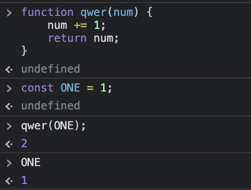
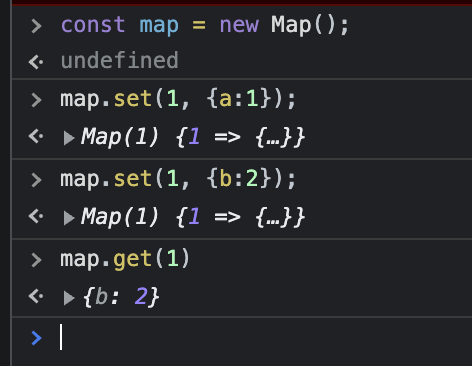

# 09. 데이터 조직화

- 데이터 구조에 집중한 리팩터링
- 하나의 변수가 여러 목적 -> 변수 쪼개기(9.1)
- 변수 이름은 중요하다 -> 변수 이름 바꾸기(9.2)
- 때론 변수 자체를 없애는게 좋을 수도 있다 -> 파생 변수를 질의 함수로 바꾸기(9.3)
- 참조 vs 값 - 햇갈리는 경우
  - 참조를 값으로 바꾸기(9.4)
  - 값을 참조로 바꾸기(9.5)
- 코드 의미를 알기 어려운 리터럴(상수) -> 매직 리터럴 바꾸기(9.6)

## 9.1 변수 쪼개기

### 9.1.1 변수 쪼개기 - 개요

```js
// before
let temp = 2 * (height + width);
console.log(temp);
temp = height * width;
console.log(temp);

// after
const perimeter = 2 * (height + width); // 사각형의 둘레
console.log(perimeter);
const area = height * width;
console.log(area);
```

### 9.1.2 변수 쪼개기 - 배경

- 변수에 값을 여러번 대입할 수 밖에 없는 경우

  - 루프 변수(for문)
  - 수집 변수(collecting variable) : e.g., i = i + something
    - 총합 계산, 문자열 연결, 스트림에 쓰기, 컬렉션에 추가하기 등

- 긴 코드의 결과를 저장하는 변수 -> 한번만 대입해야 한다.

### 9.1.3 변수 쪼개기 - 절차

1. 변수를 선언한 곳과 값을 처음 대입하는 곳에서 변수 이름을 바꾼다.
2. 가능하면 이때 불변(immutable)으로 선언한다.
3. 이 변수에 두 번째로 값을 대입하는 곳 앞까지의 모든 참조(이 변수가 쓰인 곳)를 새로운 변수 이름으로 바꾼다.
4. 두 번째 대입 시 변수를 원래 이름으로 다시 선언한다.
5. 테스트한다.
6. 반복한다.
   매 반복에서 변수를 새로운 이름으로 선언하고 다음번 대입 때 까지의 모든 참조를 새 변수명으로 바꾼다.
   이 과정을 마지막 대입까지 반복한다. - 변수하나에 2번 이상 사용되고 있다면 이 과정을 반복한다는 의미인 것 같다

### 9.1.4 변수 쪼개기 - 예시

### 9.1.4 - 2. 예시: 입력 매개변수의 값을 수정할 때



- 그럼에도 불구하고 매개변수를 사용할 때 변수에 담아서 사용한다.

## 9.2 필드 이름 바꾸기

### 9.2.1 필드 이름 바꾸기 - 개요

```js
// before
class Organization {
  get name() {...}
}

// after
class Organization {
  get title() {...}
}
```

### 9.2.2 필드 이름 바꾸기 - 배경

- 이름은 중요하다
- 레코드(구조체)의 필드 이름은 특히 더 중요하다
- 클래스의 게터와 세터 이름 바꾸기도 레코드 필드이름과 똑같이 중요하다

### 9.2.3 필드 이름 바꾸기 - 절차

1. 레코드의 유효 범위가 제한적이라면 필드에 접근하는 모든 코드를 수정한 후 테스트한다.
   이후 단계는 필요없다.
2. 레코드가 캡슐화되지 않았다면 우선 레코드를 캡슐화(7.1) 한다.
3. 캡슐화된 객체 안의 private 필드명을 변경하고, 그에 맞게 내부 메서드들을 수정한다.
4. 테스트한다.
5. 생성자의 매개변수 중 필드와 이름이 겹치는게 있다면 함수 선언 바꾸기(6.5)로 변경한다.
6. 접근자들의 이름도 바꿔준다(6.5).

### 9.2.4 필드 이름 바꾸기 - 예시

```js
// 필드 이름 바꾸기의 대상 레코드
const organization = { name: "애크미 구스베리", country: "GB" }; // Country code => GB: United States, KR: Korea Republic

// 2. [레코드가 캡슐화되지 않았다면 우선 레코드를 캡슐화(7.1) 한다.]
// - organization 레코드 캡슐화(7.1)

class Organization {
  constructor(data) {
    this._name = data.name;
    this._country = data.country;
  }
  get name() {
    return this._name;
  }
  set name(aString) {
    this._name = aString;
  }
  get country() {
    return this._country;
  }
  set country(aCountryCode) {
    this._country = aCountryCode;
  }
}

const organization = new Organization({
  name: "애크미 구스베리",
  country: "GB",
});
```

3. [캡슐화된 객체 안의 private 필드명을 변경하고, 그에 맞게 내부 메서드들을 수정한다.]

- 별도의 필드를 정의하고 생성자와 접근자에서 둘을 구분해 사용한다.

```js
class Organization {
  constructor(data) {
    // this._title = data.name; // _name을 _title으로 변경 -> 생성자에서 title도 받아들일 수 있도록 조치
    this._title = data.title !== undefined ? data.title : data.name;
    this._country = data.country;
  }
  get name() {
    return this._title;
  } // _title을 사용
  set name(aString) {
    this._title = aString;
  }
  get country() {
    return this._country;
  }
  set country(aCountryCode) {
    this._country = aCountryCode;
  }
}
```

- 인스턴스 생성 시 사용하던 name을 title로 하나씩 변경 후 다 변경하면 name을 생성자에서 제거

6. [접근자들의 이름도 바꿔준다.]

```js
class Organization {
  constructor(data) {
    // this._title = data.name; // _name을 _title으로 변경 -> 생성자에서 title도 받아들일 수 있도록 조치
    this._title = data.title;
    this._country = data.country;
  }
  get title() {
    return this._title;
  } // _title을 사용
  set title(aString) {
    this._title = aString;
  }
  get country() {
    return this._country;
  }
  set country(aCountryCode) {
    this._country = aCountryCode;
  }
}
```

## 9.3 파생 변수를 질의 함수로 바꾸기

### 9.3.1 파생 변수를 질의 함수로 바꾸기 - 개요

```js
// before
class SomeClass {
  get discountedTotal() {
    return this._discountedTotal;
  }
  set discount(aNumber) {
    const old = this._discount;
    this._discount = aNumber;
    this._discountedTotal += old - aNumber;
  }
}

// after
class SomeClass {
  get discountedTotal() {
    return this._baseTotal - this.discount;
  } // _discountedTotal을 없앰
  set discount(aNumber) {
    this._discount = aNumber;
  }
}
```

### 9.3.2 파생 변수를 질의 함수로 바꾸기 - 배경

- 가변 데이터의 유효범위를 가능한 좁히자

### 9.3.3 파생 변수를 질의 함수로 바꾸기 - 절차

1. 변수 값이 갱신되는 지점을 모두 찾는다. 필요하면 변수 쪼개기(9.1)를 활용해 각 갱신 지점에서 변수를 분리한다.
2. 해당 변수의 값을 계산해주는 함수를 만든다.
3. 해당 변수가 사용되는 모든 곳에 어서션(assertion)을 추가(10.6)하여 함수의 계산 결과가 변수의 값과 같은지 확인한다.

- 필요하면 변수 캡슐화하기(6.8)를 적용하여 어서션이 들어갈 장소를 마련해준다.

4. 테스트한다.
5. 변수를 읽는 코드를 모두 함수 호출로 대체한다.
6. 테스트한다.
7. 변수를 선언하고 갱신하는 코드를 죽은 코드 제거하기(8.9)로 없앤다.

### 9.3.4 예시

### 9.3.4 - 2. 예시: 소스가 둘 이상일 때

## 9.4 참조를 값으로 바꾸기

### 9.4.1 참조를 값으로 바꾸기 - 개요

```js
// before
class Product {
  // price에 Price 클래스가 있고 그 안의 amount를 사용할 때 마다 arg를 빼줘야 되는 상황
  applyDiscount(arg) {this._price.amount -= arg;}
}

// after
class Product {
  // Price에 새로 생성한 Money 클래스를 넣어서 사용
  this._price = new Money(this._price.amount - arg, this._price.currency);
}
```

### 9.4.2 참조를 값으로 바꾸기 - 배경

- 객체(데이터 구조)를 다른 객체(데이터 구조)에 `중첩하면` 내부 객체를 참조 혹은 값으로 취급할 수 있다.
- 참조 vs 값 => 차이 : 내부 객체의 속성을 갱신하는 방식

  - 참조 : 내부 객체는 그대로 둔 채 그 객체의 속성만 갱신
  - 값 : 새로운 속성을 담은 객체로 기존 내부 객체를 통째로 대체

- 필드를 값으로 다룬다면 내부 객체의 클래스를 수정하여 값 객체(Value Object)로 만들 수 있다. - 값 객체 : 개요의 Money 객체
- 값 객체는 대체로 자유롭게 활용하기 좋은데, 특히 불변이기 때문이다.

  - 값 객체는 분산 시스템과 동시성 시스템에서 특히 유용하다.

- 값 객체의 이런 특성(불변) 때문에 리팩터링 적용하면 안되는 상황
  - 특정 객체를 여러 객체에서 공유하고자 한다면 -> 공유 객체의 값을 변경했을 때 이를 관련 객체 모두에 알려줘야 한다면 공유 객체를 참조로 다뤄야 한다

### 9.4.3 참조를 값으로 바꾸기 - 절차

1. 후보 클래스가 불변인지, 혹은 불변이 될 수 있는지 확인한다.
2. 각각의 세터를 하나씩 제거(11.7절)한다.
3. 이 값 객체의 필드들을 사용하는 동치성 비교 메서드를 만든다.

- 대부분의 언어는 이런 상황에 사용할 수 있도록 오버라이딩 가능한 동치성 비교 메서드를 제공한다.
  동치성 비교 메서드를 오버라이드할 때는 보통 해시코드 생성 메서드도 함께 오버라이드해야한다.

### 9.4.4 참조를 값으로 바꾸기 - 예시

- 값 객체로 인정받으려면 동치성을 값 기반으로 평가해야 한다.
  - 자바스크립트는 아쉽지만 참조 기반 동치성을 값 기반 동치성으로 대체하는 일과 관련하여 언어나 핵심 라이브러리 차원에서 지원해주는 게 없다.
  - 대안 : equals 메서드를 직접 작성하는 것

```js
// equals 메서드 직접 작성
class TelephoneNumber {
  equals(other) {
    if (!(other instanceof TelephoneNumber)) return false;
    return this.areaCode === other.areaCode && this.number === other.number;
  }
}

// test
it("telephone equals", function () {
  assert(
    new TelephoneNumber("312", "555-0142").equals(
      new TelephoneNumber("312", "555-0142")
    )
  );
});
```

- 이 테스트의 핵심 -> 독립된 객체를 두 개 생성하여 동치성 검사를 수행

- 대부분의 객체 지향 언어는 값 기반 동치성 비교를 할 수 있도록 오버라이드 가능한 동치성 검사수단을 기본으로 제공한다.
  루비(Ruby)에서는 == 연산자를 오버라이드하면 되고, 자바에서는 Object.equals() 메서드를 오버라이드하면 된다.
  그리고 동치성 검사 메서드를 오법라이드할 때는 해시코드 생성 메서드도 함께 오버라이드해야 하는게 보통이다.(자바에서는 Object.hashCode() 메서드).
  그래야 해시 기반으로 동작하는 컬렉션이 새로 만든 값도 문제없이 다룰 수 있다.

- 전화번호를 사용하는 곳이 둘 이상이라도 절차는 똑같다.
  세터를 제거(11.7)할 때 해당 사용처 모두를 수정하면 된다.
  번호가 다른 전화번호들로 비교해보고, 유효하지 않은 번호나 null 값과도 비교해보면 좋다.

## 9.5 값을 참조로 바꾸기

### 9.5.1 값을 참조로 바꾸기 - 개요

```js
// before
let customer = new Customer(customerData);

// after
let customer = customerRepository.get(customerData.id);
```

### 9.5.2 값을 참조로 바꾸기 - 배경

- 하나의 데이터 구조 안에 논리적으로 똑같은 제 3의 데이터 구조를 참조하는 레코드가 여러 개 있을 때가 있다.
  - 예) 주문 목록 - 고객이 요청한 주문이 여러 개 섞여 있을 수 있음
- 일반적으로 복사해서 사용
- 논리적으로 같은 데이터를 물리적으로 복제해 사용할 때 가장 크게 문제되는 상황은 그 데이터를 갱신해야 할 때 이다.
  - 모든 복제본을 빠짐없이 갱신해야 하며, 하나라도 놓치면 데이터 일관성이 깨져버린다.
  - 이런 상황이라면 복제된 데이터들을 모두 참조로 바꿔주는 게 좋다.
- 값을 참조로 바꾸면 엔티티(entity) 하나 당 객체도 단 하나만 존재하게 되는데,
  이런 객체를 한데 모아 놓고 클라이언트들의 접근을 관리해주는 일종의 저장소가 필요해진다.
  각 엔티티를 표현하는 객체를 한 번만 만들고, 객체가 필요한 곳에서는 모두 이 저장소로부터 얻어 쓰는 방식이 된다.

### 9.5.3 값을 참조로 바꾸기 - 절차

1. 같은 부류에 속하는 객체들을 보관할 저장소를 만든다(이미 있다면 생략).
2. 생성자에서 이 부류의 객체들 중 특정 객체를 정확히 찾아내는 방법이 있는지 확인한다.
3. 호스트 객체의 생성자들을 수정하여 필요한 객체를 이 저장소에서 찾도록 한다.
   하나 수정할 때마다 테스트한다.

### 9.5.4 값을 참조로 바꾸기 - 예시

1. [같은 부류에 속하는 객체들을 보관할 저장소를 만든다(이미 있다면 생략).]

- 항상 물리적으로 똑같은 고객 객체를 사용하고 싶다면 먼저 이 유일한 객체를 저장해둘 곳이 있어야한다.
  - 저정소 객체(repository object)를 사용하는 편
    - https://martinfowler.com/eaaCatalog/repository.html

```js
// 저정소 객체(repository object) 예시
let _repositoryData;

export function initialize() {
  _repositoryData = {};
  _repositoryData.customers = new Map();
}

export function registerCustomer(id) {
  if (!_repositoryData.customers.has(id)) {
    _repositoryData.customers.set(id, new Customer(id));
  }
  return findCustomer(id);
}

export function findCustomer(id) {
  return _repositoryData.customers.get(id);
}
```

- 이 저장소는 고객 객체를 ID와 함께 등록할 수 있으며,
  ID하나 당 오직 하나의 고객 객체만 생성됨을 보장한다.
  - 
  - overwrite 함

**javascript Map**

- Map 객체는 키-값 쌍을 보유하고 키의 원래 삽입 순서를 기억합니다. 모든 값(객체 및 기본 값 모두)은 키 또는 값으로 사용할 수 있습니다.
- https://developer.mozilla.org/en-US/docs/Web/JavaScript/Reference/Global_Objects/Map

전역 객체는 독이 될 수도 있다.

- 의존성 주입(dependency injection) 중 생성자 주입을 이용하자

## 9.6 매직 리터럴 바꾸기

- 마법 숫자를 기호 상수로 전환

### 9.6.1 매직 리터럴 바꾸기 - 개요

```js
// before
function potentialEnergy(mass, height) {
  return mass * 9.81 * height;
}

// after
const STANDARD_GRAVITY = 9.81;
function potentialEnergy(mass, height) {
  return mass * STANDARD_GRAVITY * height;
}
```

### 9.6.2 매직 리터럴 바꾸기 - 배경

- 매직 리터럴 : 소스코드에 (보통은 여러곳에) 등장하는 일반적인 리터럴 값
- 의미를 명확히 하기 위해 구상수를 정의하고 숫자 또는 약어 대신 사용한다.

### 9.6.3 매직 리터럴 바꾸기 - 방법

1. 상수를 선언하고 매직 리터럴을 대입한다.
2. 해당 리터럴이 사용되는 곳을 모두 찾는다.
3. 찾은 곳 각각에서 리터럴이 새 상수와 똑같은 의미로 쓰였는지 확인하여, 같은 의미라면 상수로 대체한 후 테스트한다.
